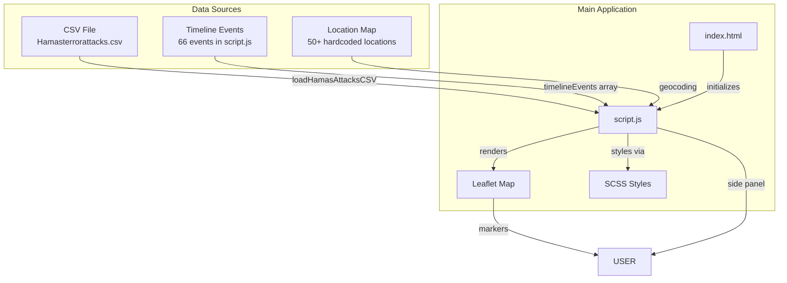
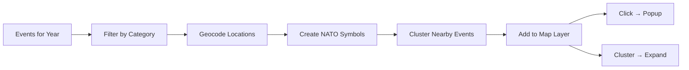
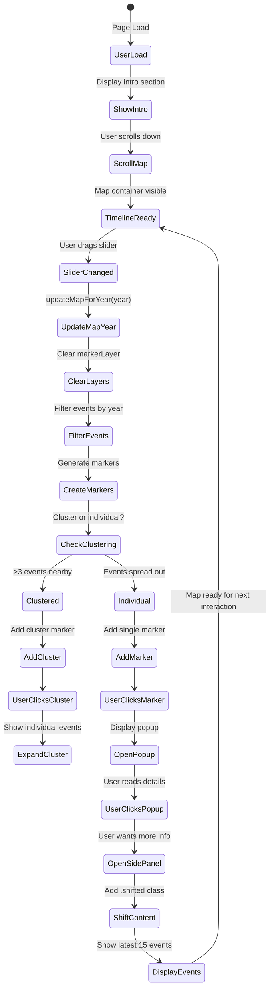
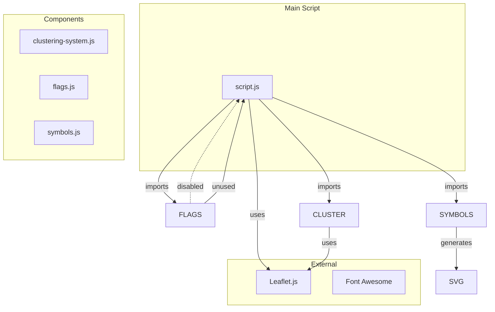
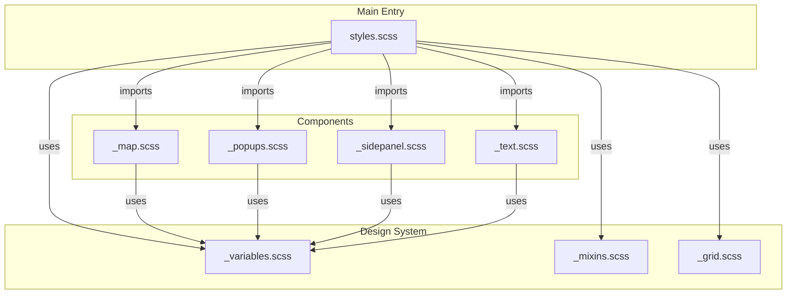
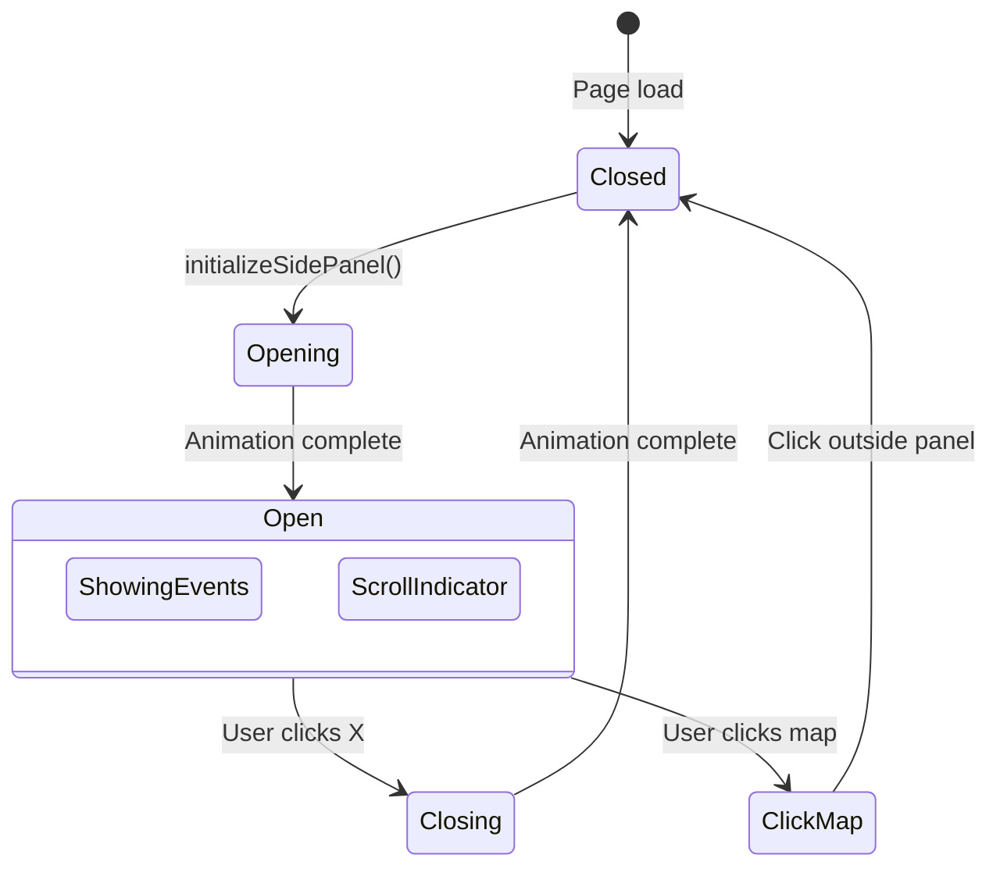
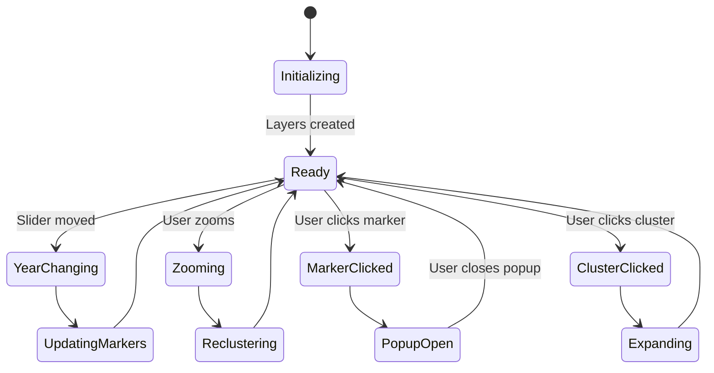

# Project Architecture & Component Lifecycle

> **Auto-generated documentation** - Run `npm run docs:update` to refresh diagrams based on current file structure.

## Table of Contents

1. [File Structure](#file-structure)
2. [Data Flow](#data-flow)
3. [Component Lifecycle](#component-lifecycle)
4. [Event Lifecycle](#event-lifecycle)
5. [Dependency Graph](#dependency-graph)
6. [State Machine](#state-machine)
7. [Key Functions Reference](#key-functions-reference)

---

## File Structure

```
2026-Conflict/
├── 📄 index.html
├── 📄 package.json
├── 📄 README.md
├── 📄 ARCHITECTURE.md
│
├── 📂 js/
│   ├── 📄 script.js
│   └── 📂 components/
│       ├── 📄 clustering-system.js
│       ├── 📄 flags.js
│       └── 📄 symbols.js
│
├── 📂 scss/
│   ├── 📄 styles.scss
│   ├── 📄 _grid.scss
│   ├── 📄 _mixins.scss
│   ├── 📄 _variables.scss
│   ├── 📄 _inline-styles.scss
│   ├── 📄 _map.scss
│   ├── 📄 _popups.scss
│   ├── 📄 _sidepanel.scss
│   ├── 📄 _text.scss
│   └── 📂 components/
│       ├── 📄 _map.scss
│       ├── 📄 _popups.scss
│       ├── 📄 _sidepanel.scss
│       └── 📄 _text.scss
│
├── 📂 data/
│   └── 📄 Hamasterrorattacks.csv
│
└── 📂 assets/
```

---

## Data Flow



---

## Component Lifecycle

### Map Initialization

```mermaid
stateDiagram-v2
    [*] --> loadPage: User opens page
    
    loadPage --> initMap: DOM ready
    initMap --> setTileLayer: CARTO Light All
    setTileLayer --> setCenter: [31.5, 35.0]
    setCenter --> setDefaultZoom: Level 7
    
    setDefaultZoom --> initLayers: Create layer groups
    initLayers --> initClustering: Setup clustering system
    
    initClustering --> loadInitialEvents: Load events for 1994
    loadInitialEvents --> [*]: Map ready
    
    state initLayers {
        markerLayer
        flagLayer
        movementLayer
        territoryLayer
    end
```

### Event Rendering Pipeline



---

## Event Lifecycle



---

## Dependency Graph

### JavaScript Dependencies



### SCSS Dependencies



---

## State Machine

### Side Panel States



### Map States



---

## Key Functions Reference

| Function | File | Line | Purpose |
|----------|------|------|---------|

### Initialization

| Function | File | Line | Purpose |
|----------|------|------|---------|
| `createEnhancedPopup()` | js/components/clustering-system.js | ~195 | Create Enhanced Popup |
| `createEnhancedMilitaryMarker()` | js/components/clustering-system.js | ~382 | Create Enhanced Military Marker |
| `createClusterMarker()` | js/components/clustering-system.js | ~487 | Create Cluster Marker |
| `createEventCardPopup()` | js/components/clustering-system.js | ~527 | Create Event Card Popup |
| `setupEnhancedLegend()` | js/components/clustering-system.js | ~580 | Setup Enhanced Legend |
| `setupLegendControls()` | js/components/clustering-system.js | ~769 | Setup Legend Controls |
| `createEnhancedMilitaryMarkerOptimized()` | js/components/clustering-system.js | ~927 | Create Enhanced Military Marker Optimized |
| `createClusterMarkerOptimized()` | js/components/clustering-system.js | ~965 | Create Cluster Marker Optimized |
| `initializeClusteringSystem()` | js/components/clustering-system.js | ~1167 | Initialize Clustering System |
| `setupLeftLegend()` | js/components/clustering-system.js | ~1195 | Setup Left Legend |
| `loadHamasAttacksCSV()` | js/script.js | ~38 | Load Hamas Attacks C S V |
| `initializeTimeline()` | js/script.js | ~1643 | Initialize Timeline |
| `createTimelineEvent()` | js/script.js | ~1668 | Create Timeline Event |
| `setupEventListeners()` | js/script.js | ~1729 | Setup Event Listeners |
| `initializeMap()` | js/script.js | ~1796 | Initialize Map |
| `setupMapControls()` | js/script.js | ~2262 | Setup Map Controls |
| `createTickMarks()` | js/script.js | ~2515 | Create Tick Marks |
| `initializeTimelineTicks()` | js/script.js | ~2598 | Initialize Timeline Ticks |
| `createMarkerIcon()` | js/script.js | ~2934 | Create Marker Icon |
| `createClusterCountMarker()` | js/script.js | ~3111 | Create Cluster Count Marker |
| `initializeSidePanel()` | js/script.js | ~3430 | Initialize Side Panel |
| `setupMapClickHandler()` | js/script.js | ~3472 | Setup Map Click Handler |
| `createDirectionalArrow()` | js/script.js | ~3943 | Create Directional Arrow |
| `createFactionMarker()` | js/script.js | ~4001 | Create Faction Marker |
| `createMovementNATOSymbol()` | js/script.js | ~4055 | Create Movement N A T O Symbol |
| `createMovementArrow()` | js/script.js | ~4075 | Create Movement Arrow |
| `initializeCheckboxStates()` | js/script.js | ~4189 | Initialize Checkbox States |
| `initializeScrollToMapButton()` | js/script.js | ~4440 | Initialize Scroll To Map Button |

### Rendering

| Function | File | Line | Purpose |
|----------|------|------|---------|
| `drawAllEventMarkersWithClustering()` | js/components/clustering-system.js | ~247 | Draw All Event Markers With Clustering |
| `drawAllEventMarkers()` | js/components/clustering-system.js | ~809 | Draw All Event Markers |
| `drawAllEventMarkersOptimized()` | js/components/clustering-system.js | ~1009 | Draw All Event Markers Optimized |
| `addMilitaryGrid()` | js/script.js | ~1872 | Add Military Grid |
| `addMapLegend()` | js/script.js | ~1946 | Add Map Legend |
| `updateActiveTickMarks()` | js/script.js | ~2578 | Update Active Tick Marks |
| `updateMapForYear()` | js/script.js | ~2669 | Update Map For Year |
| `drawTerritoryControl()` | js/script.js | ~2800 | Draw Territory Control |
| `updateSidePanelState()` | js/script.js | ~3257 | Update Side Panel State |
| `drawAllEventMarkers()` | js/script.js | ~3501 | Draw All Event Markers |
| `drawMovementPaths()` | js/script.js | ~3790 | Draw Movement Paths |
| `addMajorCities()` | js/script.js | ~4093 | Add Major Cities |
| `updateStatistics()` | js/script.js | ~4130 | Update Statistics |
| `updateLegendCounts()` | js/script.js | ~4164 | Update Legend Counts |
| `updateLegendForFilters()` | js/script.js | ~4201 | Update Legend For Filters |

### Data

| Function | File | Line | Purpose |
|----------|------|------|---------|
| `getEventYear()` | js/components/clustering-system.js | ~189 | Get Event Year |
| `groupEventsByCoordinates()` | js/components/clustering-system.js | ~227 | Group Events By Coordinates |
| `getSpiralOffset()` | js/components/clustering-system.js | ~238 | Get Spiral Offset |
| `determineMilitaryDetails()` | js/components/clustering-system.js | ~420 | Determine Military Details |
| `generateCompleteNATOLegend()` | js/components/clustering-system.js | ~609 | Generate Complete N A T O Legend |
| `generateFlagSubsection()` | js/components/clustering-system.js | ~745 | Generate Flag Subsection |
| `generateLegacyDropdownOptions()` | js/components/clustering-system.js | ~1208 | Generate Legacy Dropdown Options |
| `getNearbyEvents()` | js/components/clustering-system.js | ~1219 | Get Nearby Events |
| `parseCSV()` | js/script.js | ~6 | Parse C S V |
| `convertCSVToEvent()` | js/script.js | ~62 | Convert C S V To Event |
| `extractYear()` | js/script.js | ~64 | Extract Year |
| `getCoordinates()` | js/script.js | ~76 | Get Coordinates |
| `getIntensity()` | js/script.js | ~187 | Get Intensity |
| `getAllEvents()` | js/script.js | ~238 | Get All Events |
| `getAllEventsSync()` | js/script.js | ~254 | Get All Events Sync |
| `detectInvolvedNations()` | js/script.js | ~263 | Detect Involved Nations |
| `enhanceEventWithMilitaryData()` | js/script.js | ~338 | Enhance Event With Military Data |
| `filterTimeline()` | js/script.js | ~1753 | Filter Timeline |
| `filterByEra()` | js/script.js | ~1765 | Filter By Era |
| `observeTimelineEvents()` | js/script.js | ~1777 | Observe Timeline Events |
| `generateTerritoryLegend()` | js/script.js | ~2034 | Generate Territory Legend |
| `generateMilitaryFactionsLegend()` | js/script.js | ~2061 | Generate Military Factions Legend |
| `getFrameSVG()` | js/script.js | ~2106 | Get Frame S V G |
| `generateMilitarySymbolsLegend()` | js/script.js | ~2120 | Generate Military Symbols Legend |
| `generateNationalForcesLegend()` | js/script.js | ~2160 | Generate National Forces Legend |
| `generateEventTypesLegend()` | js/script.js | ~2180 | Generate Event Types Legend |
| `generateNationalForcesLegend()` | js/script.js | ~2211 | Generate National Forces Legend |
| `generateEventTypesLegend()` | js/script.js | ~2231 | Generate Event Types Legend |
| `startMapAnimation()` | js/script.js | ~2333 | Start Map Animation |
| `pauseMapAnimation()` | js/script.js | ~2363 | Pause Map Animation |
| `handleSliderChange()` | js/script.js | ~2378 | Handle Slider Change |
| `getEventYears()` | js/script.js | ~2423 | Get Event Years |
| `getYearsWithCoordinates()` | js/script.js | ~2468 | Get Years With Coordinates |
| `findNearestEventYear()` | js/script.js | ~2497 | Find Nearest Event Year |
| `handleSpeedChange()` | js/script.js | ~2623 | Handle Speed Change |
| `getEventYear()` | js/script.js | ~2632 | Get Event Year |
| `getFilteredEventsForYear()` | js/script.js | ~2661 | Get Filtered Events For Year |
| `groupEventsByCoordinates()` | js/script.js | ~3010 | Group Events By Coordinates |
| `getHierarchicalOffset()` | js/script.js | ~3046 | Get Hierarchical Offset |
| `sortEventsByPriority()` | js/script.js | ~3070 | Sort Events By Priority |
| `calculateEventPriority()` | js/script.js | ~3079 | Calculate Event Priority |
| `toggleSidePanel()` | js/script.js | ~3299 | Toggle Side Panel |
| `openEventSidePanel()` | js/script.js | ~3320 | Open Event Side Panel |
| `showAllVisibleEvents()` | js/script.js | ~3483 | Show All Visible Events |
| `getFactionColor()` | js/script.js | ~3706 | Get Faction Color |
| `getSpiralOffsetForCoord()` | js/script.js | ~3766 | Get Spiral Offset For Coord |
| `calculateBearing()` | js/script.js | ~3975 | Calculate Bearing |
| `getFactionDashPattern()` | js/script.js | ~3989 | Get Faction Dash Pattern |
| `syncLegendDropdown()` | js/script.js | ~4217 | Sync Legend Dropdown |
| `refreshCurrentYear()` | js/script.js | ~4228 | Refresh Current Year |


---

## Inline Styles Migration Status

### ✅ Completed (2026-02-09)

| Component | File | Migration |
|-----------|------|-----------|
| Timeline event impact | script.js:1718 | `.impact-label`, `.impact-value` classes |
| Animation states | script.js:1777-1790 | `.paused`, `.running` classes |
| Slider tick marks | script.js:2558-2568 | CSS custom property `--tick-position` |
| Marker z-index | script.js:3230-3238, 3679-3695 | `.highlighted` class |
| Marker backgrounds | script.js:3620 | `.marker-hostile`, `.marker-friendly`, etc. |
| Movement popup icons | script.js:3872-3909 | `.faction-idf`, `.faction-hamas`, etc. |
| Movement arrows | script.js:3943-3972 | CSS custom properties + `.movement-arrow-container` |
| Cluster markers | clustering-system.js:499-507, 979-987 | `.cluster-small`, `.cluster-medium`, etc. |
| Popup metadata | clustering-system.js:204-208 | `.popup-metadata`, `.priority-badge-*`, `.age-indicator-*` |
| Legend arrow | clustering-system.js:643 | `.legend-arrow-icon` class |
| Legend error | clustering-system.js:1205 | `.error-message` class |
| Flag icons | flags.js:67-72 | CSS custom properties `--flag-width`, `--flag-height` |

### 📊 Statistics

- **Inline styles migrated**: 18 occurrences
- **New SCSS file**: `scss/_inline-styles.scss` (~450 lines)
- **CSS classes created**: 40+ reusable classes
- **CSS custom properties**: 8 (for dynamic values)

### 📁 Files Modified

1. `scss/_inline-styles.scss` - New centralized migration file
2. `scss/styles.scss` - Added import for `_inline-styles.scss`
3. `js/script.js` - Replaced 12 inline style occurrences
4. `js/components/clustering-system.js` - Replaced 4 inline style occurrences
5. `js/components/flags.js` - Replaced 2 inline style occurrences

### 🎯 Benefits Achieved

- **Consistency**: All design tokens from `_variables.scss` now used
- **Maintainability**: Styles centralized in one file
- **Debugging**: Clear source files in DevTools
- **Performance**: CSS caching works better
- **Readability**: JS files focus on logic, CSS on styling

---

## Auto-Update Instructions

To regenerate this document based on current file structure:

```bash
npm run docs:update
```

This script:
1. Scans `js/` and `scss/` directories
2. Extracts import/dependency relationships
3. Updates the File Structure section
4. Updates the Dependency Graph section
5. Rebuilds Mermaid diagrams

---

---

## Lessons Learned & Recent Changes (2026-02-09)

### Timeline Slider Redesign

**Changes Made:**

1. **SCSS** (`scss/components/_map.scss:173-285`)
   - Slider: 4px height, no border-radius, solid line
   - Thumb: 4px × 24px vertical line (no border/box-shadow)
   - Ticks: Positioned absolutely, aligned with track
   - Tick container: `top: 10px` to align with slider
   - Labels: `top: 14px` (4px below tick container)

2. **JavaScript** (`js/script.js:2513-2597, 2378-2420`)
   - `createTickMarks()`: Now creates ticks for every year (1900-2025)
   - `handleSliderChange()`: Snaps to nearest year using `Math.round()`
   - Tick container: Positioned before slider for proper alignment

3. **Legend Toggle Fix** (`js/script.js:4441-4464`)
   - Changed from `querySelector(...).remove()` to using stored `window.mapLegendControl.remove()`
   - Fixed SCSS nesting issue where `#toggle-legend-btn` was incorrectly nested inside `.map-controls`

### Mistakes Made & Fixes Applied

| Mistake | Root Cause | Fix |
|---------|------------|-----|
| Ticks not aligned with slider line | `slider-track-container` had `top: 0` | Changed to `top: 10px` |
| Ticks not centered vertically | Conflicting `top` values on ticks | Removed variable heights, kept `top: -2px` |
| Ticks above dates (visually) | Labels had wrong `top` value | Changed from `top: 6px` to `top: 14px` |
| Legend toggle not working | Used `querySelector('.legacy-map-legend')` instead of stored control reference | Use `window.mapLegendControl.remove()` |
| SCSS compilation error | `#toggle-legend-btn` incorrectly nested in `.map-controls` | Moved styles outside nesting |

### Key Lessons

1. **SCSS Nesting**: When using nested SCSS, ensure child selectors are properly closed before sibling rules. The `#toggle-legend-btn` styles were inside `.map-controls` without proper closing braces.

2. **Leaflet Control Removal**: Leaflet controls require using their `.remove()` method, not DOM removal. Store the control reference (`window.mapLegendControl`) when creating it.

3. **Absolute Positioning Alignment**: When aligning elements with `position: absolute`:
   - Parent container needs correct `top` positioning
   - Child elements need `transform: translateX(-50%)` for horizontal centering
   - Vertical alignment requires matching `top` values or offsets

4. **Timeline Ticks**: Creating ticks for every year vs. only event years:
   - Every year provides smoother UX with consistent feedback
   - Snap to nearest year using `Math.round()` for predictable behavior
   - Decade labels only (every 10 years) prevents overcrowding

### Functions Updated Today

| Function | File | Line | Change |
|----------|------|------|--------|
| `toggleLegend()` | js/script.js | 4441 | Fixed legend removal logic |
| `createTickMarks()` | js/script.js | 2513 | Create ticks for all years |
| `handleSliderChange()` | js/script.js | 2378 | Snap to nearest year |

---

## 🤖 AI Assistant Reminder

**Always read ARCHITECTURE.md before making changes!**

This file contains:
- Current project state and recent changes
- Lessons learned from past mistakes
- Function locations and purposes
- SCSS structure and patterns

Reading this first prevents:
- Repeating fixes already applied
- Making the same mistakes
- Breaking working functionality

---

*Last updated: 2026-02-09*
*Generated by: scripts/generate-architecture.js*
