# 2026-Conflict Project - Architecture Diagrams

> Comprehensive visualization of project structure, data flow, and system architecture

---

## 1. Project Structure

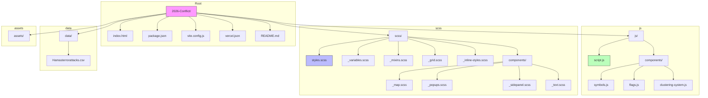

---

## 2. Component Hierarchy

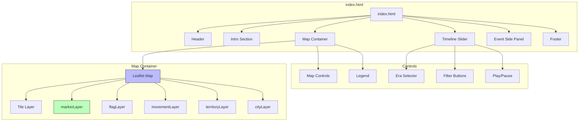

---

## 3. Script Loading Order

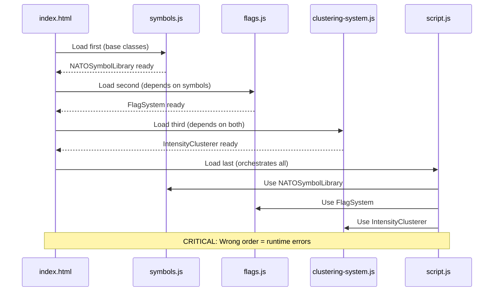

---

## 4. Data Flow

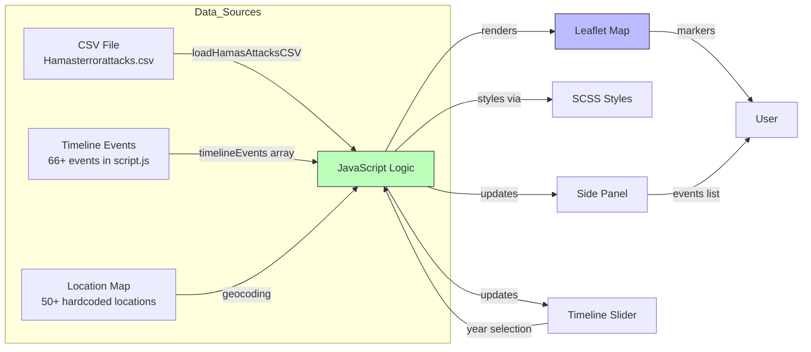

---

## 5. Event Lifecycle

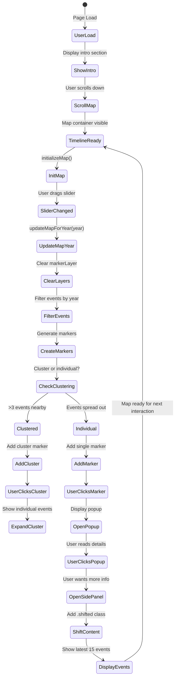

---

## 6. State Management

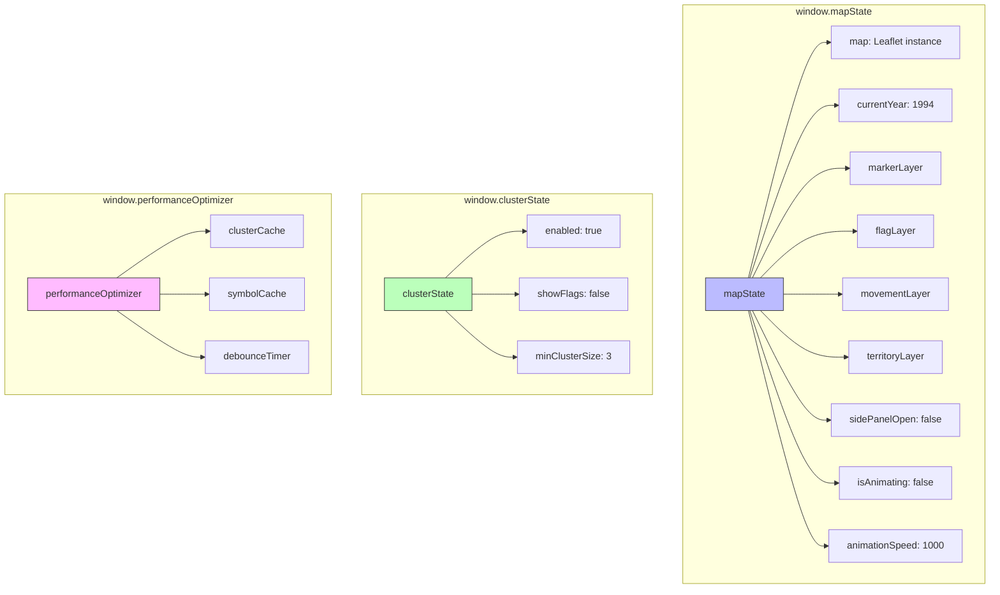

---

## 7. Key Functions Reference

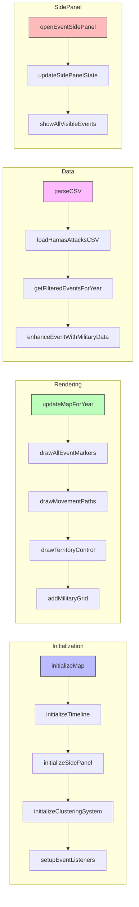

---

## 8. Layer Management

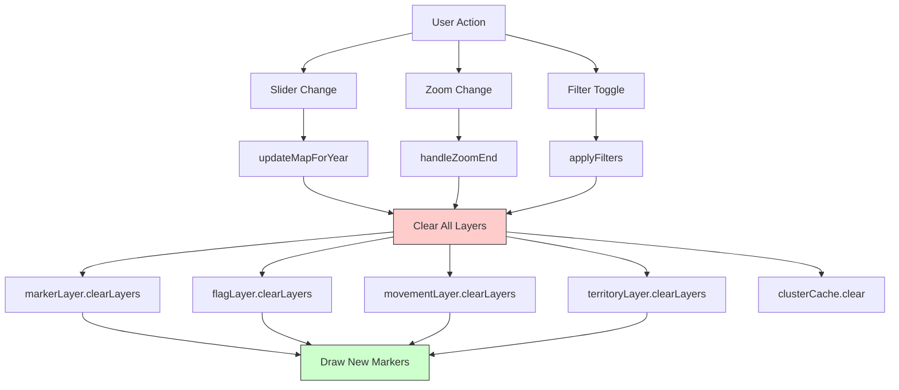

---

## 9. Deployment Flow

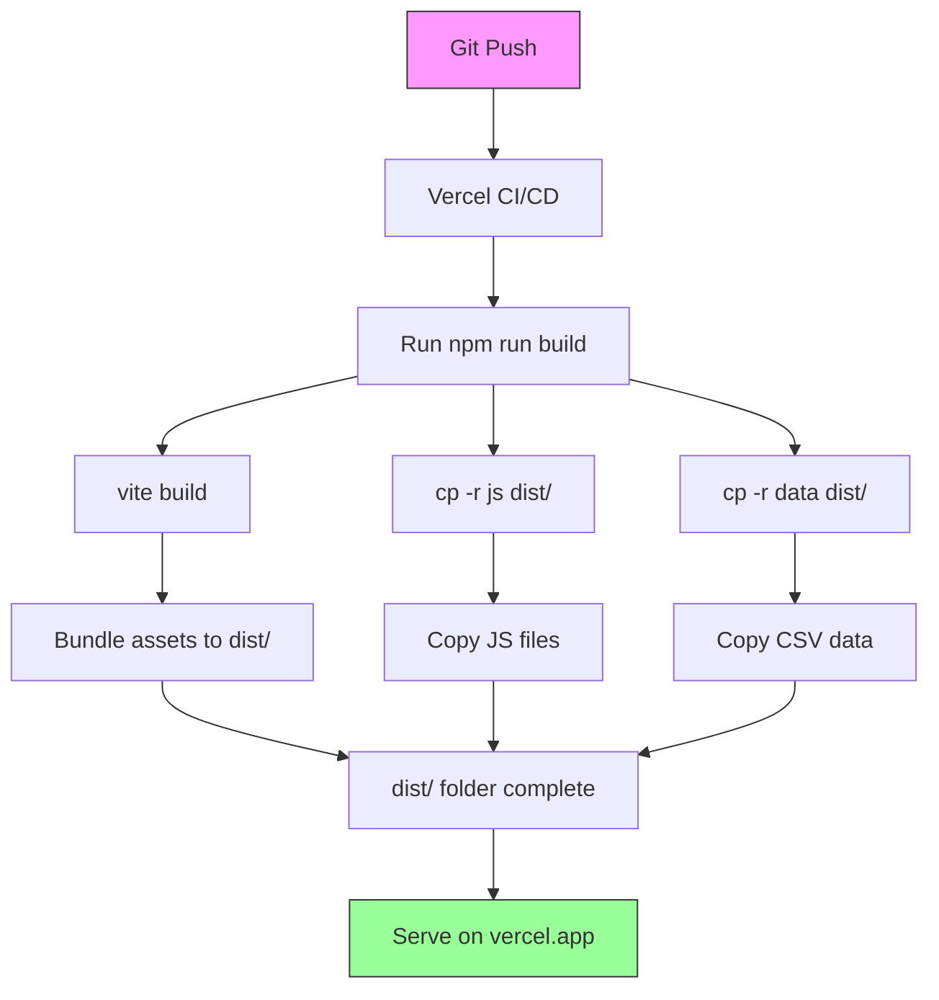

---

## 10. Development Timeline

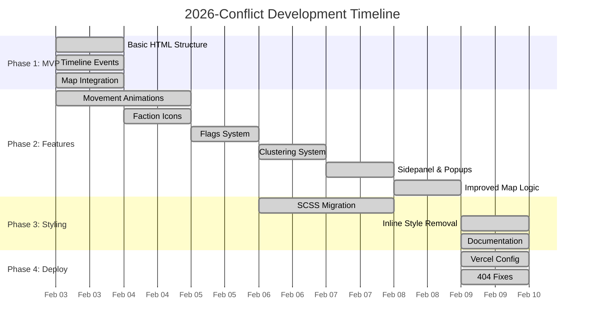

---

## 11. Color System (NATO Affiliation)

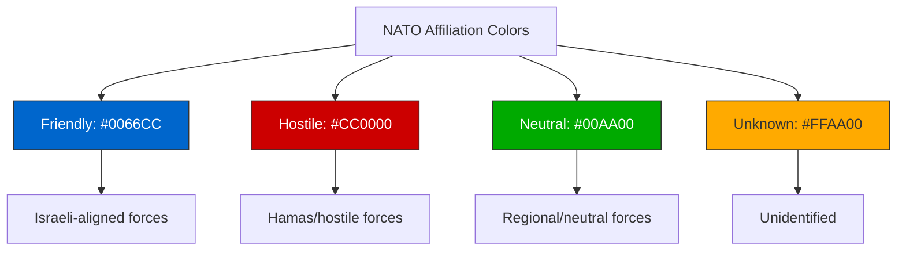

---

## 12. Event Data Structure

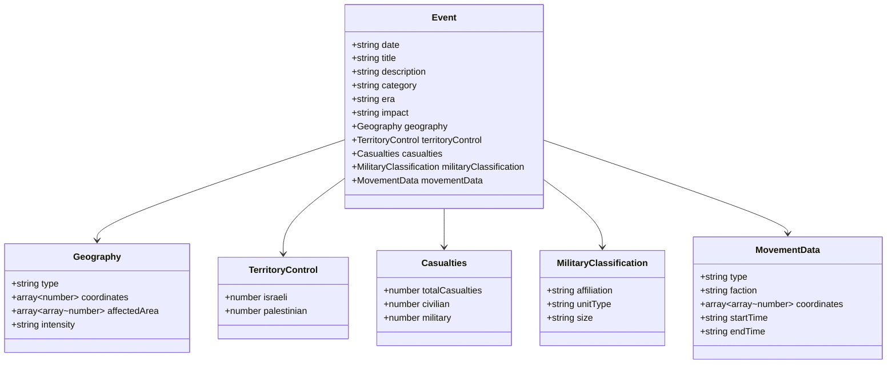

---

## 13. Problem-Solution Flowchart

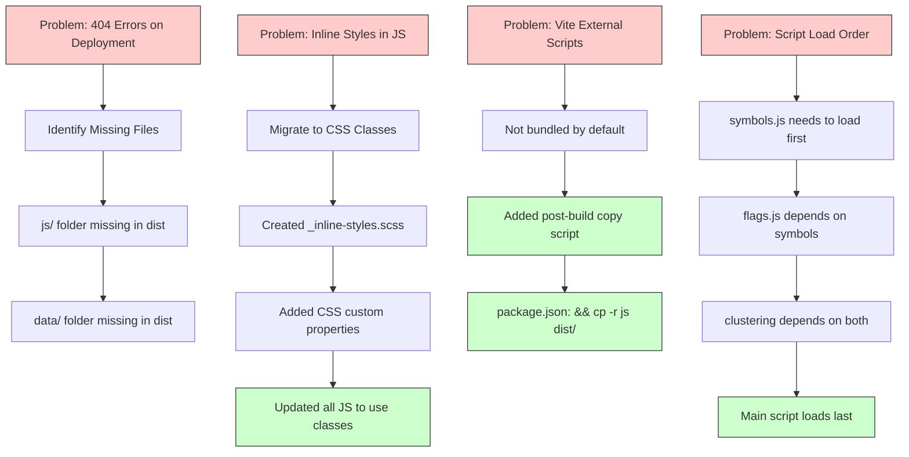

---

## 14. User Interaction Flow

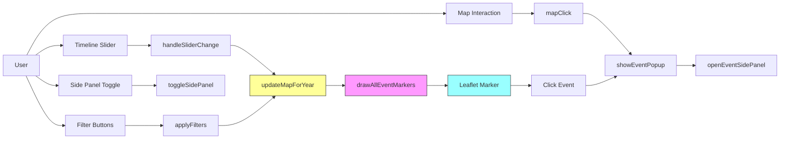

---

## 15. SCSS Architecture

```mermaid
flowchart LR
    subgraph Entry_Point
        A[styles.scss] --> B[@import statements]
    end
    
    subgraph Foundation
        B --> C[_variables.scss]
        B --> D[_mixins.scss]
        B --> E[_grid.scss]
    end
    
    subgraph Components
        B --> F[components/_map.scss]
        B --> G[components/_popups.scss]
        B --> H[components/_sidepanel.scss]
        B --> I[components/_text.scss]
    end
    
    subgraph Utilities
        B --> J[_inline-styles.scss]
    end
    
    C --> K[CSS Bundle]
    D --> K
    E --> K
    F --> K
    G --> K
    H --> K
    I --> K
    J --> K
    
    style A fill:#bbf,stroke:#333
    style K fill:#bfb,stroke:#333
```

---

> Document generated for 2026-Conflict project visualization
