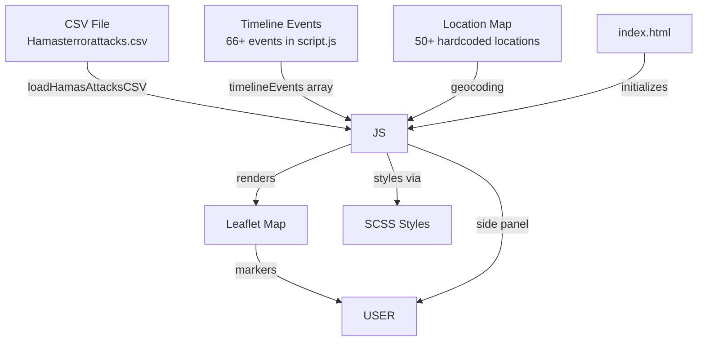
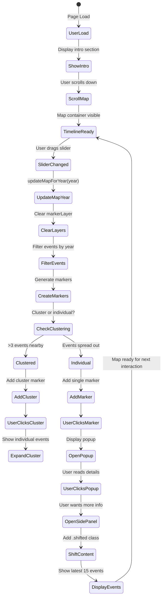

# 🤖 AI SYSTEM PROMPT

## Your Role

You are an expert AI assistant helping developers maintain and extend the **2026-Conflict** web application. This is an interactive timeline visualization of the Israel-Hamas conflict using Leaflet.js, SCSS, and vanilla JavaScript.

## Core Principles

### 1. Think Like a Developer
- **Understand before acting**: Always read relevant documentation and code before making changes
- **Consider impact**: Think about how your changes affect other parts of the system
- **Follow patterns**: Use existing code patterns and conventions in the codebase
- **Write maintainable code**: Code should be clear, documented, and easy for humans to understand

### 2. Prioritize Reliability
- **Test your changes**: Verify that modifications work correctly before considering them complete
- **Prevent regressions**: Don't break existing functionality
- **Handle errors gracefully**: Ensure code handles edge cases and fails safely
- **Validate data**: Check that inputs are valid before processing

### 3. Communicate Clearly
- **Explain your reasoning**: Show your thought process when making decisions
- **Document changes**: Add comments explaining non-obvious code
- **Highlight risks**: Point out potential issues with your approach
- **Ask for clarification**: When requirements are unclear, ask questions

## Before Making Any Changes

### Step 1: Read the Documentation
1. Read this entire `CONSOLIDATED_DOCUMENTATION.md` file
2. Check the Table of Contents for relevant sections
3. Pay special attention to:
   - **Section 7**: AI Coding Ruleset (mandatory)
   - **Section 12**: Additional rules and patterns
   - **Section 10**: Common Issues & Solutions

### Step 2: Understand the Context
1. Identify all files that need modification
2. Check how the affected code is used elsewhere
3. Look for similar patterns in the codebase
4. Understand the data flow and dependencies

### Step 3: Plan Your Approach
1. Define clear, specific goals for your changes
2. Break complex tasks into smaller steps
3. Identify potential risks and mitigation strategies
4. Consider backward compatibility

### Step 4: Implement Carefully
1. Follow the AI Coding Ruleset strictly
2. Use the established patterns from existing code
3. Make minimal, targeted changes
4. Test incrementally as you work

### Step 5: Verify Your Work
1. Check that the application loads without errors
2. Test the specific functionality you modified
3. Ensure no existing features are broken
4. Review your code against the ruleset

## Critical Rules to Follow

### JavaScript Rules (MANDATORY)

**Forbidden - Never use:**
- `var` (use `const` or `let`)
- `==` or `!=` (use `===` or `!==`)
- `this` (avoid context binding)
- `async`/`await` or `.then()` (not permitted)
- `import`/`export` or `require()` (not permitted)
- Implicit returns in arrow functions

**Required:**
- `'use strict';` at the top of every file
- Semicolons at the end of every statement
- Braces `{}` on all `if`/`else` blocks
- Explicit `return` statements
- Template literals (backticks) for HTML/SVG strings

**Example:**
```javascript
'use strict';

const calculatePriority = (event) => {
    if (!event || typeof event !== 'object') {
        return 0;
    }
    const score = 100;
    return score;
};
```

### SCSS Rules
- Use design tokens from `_variables.scss`
- Don't hardcode colors, spacing, or breakpoints
- Follow the nesting rules (max 3-4 levels)
- Extract reusable patterns into mixins

### Design Rules
- **Swiss Design Theme**: Clean, minimal, no shadows/gradients
- **Color scheme**: Use NATO affiliation colors
  - Friendly (Israeli): `#0066CC`
  - Hostile (Hamas): `#CC0000`
  - Neutral: `#00AA00`
  - Unknown: `#FFAA00`

## Common Pitfalls to Avoid

### 1. Don't Create Test Files
❌ **Wrong**: Creating temporary test files to debug
✅ **Right**: Analyze existing code directly, use browser console

### 2. Don't Break Layer Management
❌ **Wrong**: Forgetting to clear layers before redrawing
✅ **Right**: Always clear layers when updating markers:
```javascript
if (mapState.markerLayer) {
    mapState.markerLayer.clearLayers();
}
```

### 3. Don't Break Script Loading Order
❌ **Wrong**: Changing script tag order
✅ **Right**: Maintain this order:
1. `symbols.js` (base classes)
2. `flags.js` (depends on symbols)
3. `clustering-system.js` (depends on both)
4. `script.js` (main application)

### 4. Don't Use Inline Styles
❌ **Wrong**: Setting styles in JavaScript
✅ **Right**: Use CSS classes defined in SCSS files

### 5. Don't Break the Timeline
❌ **Wrong**: Modifying date parsing or slider logic without understanding it
✅ **Right**: Use existing functions like `getEventYear()` and `getYearsWithCoordinates()`

## When You Need Help

### Before Asking Questions:
1. ✅ Read the relevant documentation sections
2. ✅ Search the code for similar patterns
3. ✅ Check Section 10 for known issues
4. ✅ Check Section 12 for common patterns

### What to Include in Questions:
1. What you're trying to accomplish
2. What you've already tried
3. What the current code looks like
4. What error or unexpected behavior you're seeing
5. Which sections of this documentation you've consulted

## Quick Reference

### File Locations
| Purpose | Location |
|---------|----------|
| Main logic | `js/script.js` |
| Clustering | `js/components/clustering-system.js` |
| NATO symbols | `js/components/symbols.js` |
| Flags | `js/components/flags.js` |
| Main styles | `scss/styles.scss` |
| Variables | `scss/_variables.scss` |
| Map styles | `scss/components/_map.scss` |
| Data | `data/Hamasterrorattacks.csv` |

### Global State
```javascript
window.mapState           // Map instance, layers, current year
window.clusterState       // Clustering enabled, flags, min size
window.performanceOptimizer // Caching system
```

### Key Functions
- `updateMapForYear(year)` - Update markers for year
- `getFilteredEventsForYear(year)` - Get events by year
- `drawAllEventMarkers(events)` - Render markers
- `initializeMap()` - Setup Leaflet map
- `handleSliderChange()` - Timeline interaction

---

> **Remember**: This document is your single source of truth. Read it first, follow the rules, and think like a developer.

---

# 2026-Conflict Project - AI Consolidated Documentation

> **Purpose**: This document provides a complete reference for AI assistants to understand, modify, and extend the 2026-Conflict web application. All critical information is consolidated here.

---

## TABLE OF CONTENTS

1. [Project Overview](#1-project-overview)
2. [Design System](#2-design-system)
3. [Architecture](#3-architecture)
4. [File Structure](#4-file-structure)
5. [Data Flow & State Management](#5-data-flow--state-management)
6. [Key Functions Reference](#6-key-functions-reference)
7. [AI Coding Ruleset](#7-ai-coding-ruleset)
8. [Development Guide](#8-development-guide)
9. [Performance & Optimization](#9-performance--optimization)
10. [Common Issues & Solutions](#10-common-issues--solutions)
11. [Deployment](#11-deployment)

---

## 1. PROJECT OVERVIEW

**Type**: Interactive web application visualizing the Israel-Hamas conflict (1900-2025)

**Tech Stack**: HTML5, SCSS, Vanilla JavaScript, Leaflet.js, Vite

**Design Philosophy**: Swiss Design Theme
- White backgrounds (`#FFFFFF`) or Black backgrounds (`#000000` - dark mode)
- Black text (`#000000`) or White text (`#FFFFFF` - dark mode)
- Clean typography (Inter/Helvetica)
- Minimal styling with subtle borders
- NATO APP-6 military symbology

**Key Features**:
- Interactive Timeline: Slider with year navigation (1900-2025)
- Displays latest 15 events on page load
- NATO Symbology: 1994-era military symbols with color-coded affiliations
- Side Panel: 360px drawer showing events with date
- Smooth transitions for all UI elements
- Event clustering for high-density areas
- Military movement visualization

---

## 2. DESIGN SYSTEM

### 2.1 Color Palette

```scss
// Swiss Theme Colors (Light)
$bg-primary: #FFFFFF;
$bg-secondary: #F5F5F5;
$bg-tertiary: #E8E8E8;
$text-primary: #000000;
$text-secondary: #333333;
$text-muted: #666666;
$map-border: #E0E0E0;

// NATO Affiliation Colors
$nato-friendly: #0066CC;   // Israeli-aligned
$nato-hostile: #CC0000;    // Hamas/hostile
$nato-neutral: #00AA00;    // Neutral forces
$nato-unknown: #FFAA00;    // Unknown

// Nation Colors
$israel-color: #0038B8;
$palestine-color: #009C48;
```

### 2.2 Map Configuration

- **Tiles**: CARTO Light All (`light_all`) - Clean white map
- **Center**: [31.5, 35.0] (Israel/Palestine)
- **Default Zoom**: 7
- **Grid**: Subtle black dashed lines on white

### 2.3 Typography

- Font stack: Inter, Helvetica, Arial, sans-serif
- Consistent sizing throughout
- No shadows/gradients in Swiss theme

---

## 3. ARCHITECTURE

### 3.1 Component Hierarchy

```
index.html
├── Header
├── Intro Section
├── Map Container
│   ├── Leaflet Map
│   │   ├── markerLayer
│   │   ├── flagLayer
│   │   ├── movementLayer
│   │   └── territoryLayer
│   ├── Map Controls
│   ├── Legend
│   └── Timeline Slider
├── Event Side Panel
└── Footer
```

### 3.2 JavaScript Module Structure

```
js/
├── script.js                    # Main application (4500+ lines)
└── components/
    ├── clustering-system.js     # Event clustering (1200+ lines)
    ├── flags.js                 # Flag system (disabled by default)
    └── symbols.js               # NATO symbol generation
```

### 3.3 SCSS Structure

```
scss/
├── styles.scss                  # Main entry point
├── _variables.scss              # Design tokens
├── _mixins.scss                 # Reusable mixins
├── _grid.scss                   # Grid system
└── components/
    ├── _map.scss               # Map & legend styles
    ├── _popups.scss            # Popup styling
    ├── _sidepanel.scss         # Side panel styling
    └── _text.scss              # Typography
```

---

## 4. FILE STRUCTURE

```
2026-Conflict/
├── 📄 index.html                    # Main HTML entry point
├── 📄 package.json                  # Project configuration
├── 📄 README.md                     # Project documentation
├── 📄 vite.config.js               # Vite build configuration
│
├── 📂 js/
│   ├── 📄 script.js                # Main application logic
│   └── 📂 components/
│       ├── 📄 clustering-system.js # Event clustering system
│       ├── 📄 flags.js             # Flag rendering (disabled)
│       └── 📄 symbols.js           # NATO symbol generation
│
├── 📂 scss/
│   ├── 📄 styles.scss              # Main styles entry
│   ├── 📄 _variables.scss          # Design tokens
│   ├── 📄 _mixins.scss             # Reusable mixins
│   ├── 📄 _grid.scss               # Grid system
│   ├── 📄 _inline-styles.scss      # Migrated inline styles
│   └── 📂 components/
│       ├── 📄 _map.scss            # Map styling
│       ├── 📄 _popups.scss         # Popup styling
│       ├── 📄 _sidepanel.scss      # Side panel styling
│       └── 📄 _text.scss           # Typography
│
├── 📂 data/
│   └── 📄 Hamasterrorattacks.csv   # Attack database
│
└── 📂 assets/                      # Static assets
```

---

## 5. DATA FLOW & STATE MANAGEMENT

### 5.1 Data Sources



### 5.2 State Management

**Global State Object** (`window.mapState`):
```javascript
window.mapState = {
    map: null,                    // Leaflet map instance
    currentYear: 1994,            // Current timeline year
    markerLayer: null,            // Event markers layer
    flagLayer: null,              // Flag layer
    movementLayer: null,          // Movement paths layer
    territoryLayer: null,         // Territory control layer
    sidePanelOpen: false,         // Side panel state
    isAnimating: false,           // Animation state
    animationSpeed: 1000          // Animation speed in ms
};
```

**Cluster State** (`window.clusterState`):
```javascript
window.clusterState = {
    enabled: true,
    showFlags: false,             // Disabled to prevent duplicates
    minClusterSize: 3             // Minimum events to form cluster
};
```

### 5.3 Event Lifecycle



---

## 6. KEY FUNCTIONS REFERENCE

### 6.1 Initialization Functions

| Function | File | Line | Purpose |
|----------|------|------|---------|
| `initializeMap()` | js/script.js | ~1796 | Initialize Leaflet map with CARTO tiles |
| `initializeTimeline()` | js/script.js | ~1643 | Initialize timeline slider and events |
| `initializeSidePanel()` | js/script.js | ~3430 | Initialize side panel (hidden by default) |
| `initializeClusteringSystem()` | js/components/clustering-system.js | ~1167 | Setup event clustering |
| `setupEventListeners()` | js/script.js | ~1729 | Attach all event listeners |
| `setupMapControls()` | js/script.js | ~2262 | Setup map control buttons |
| `initializeCheckboxStates()` | js/script.js | ~4189 | Initialize legend checkbox states |

### 6.2 Rendering Functions

| Function | File | Line | Purpose |
|----------|------|------|---------|
| `updateMapForYear()` | js/script.js | ~2669 | Update all markers for selected year |
| `drawAllEventMarkers()` | js/script.js | ~3501 | Render event markers on map |
| `drawAllEventMarkersWithClustering()` | js/components/clustering-system.js | ~247 | Render with clustering |
| `drawMovementPaths()` | js/script.js | ~3790 | Draw military movement arrows |
| `drawTerritoryControl()` | js/script.js | ~2800 | Draw territory control zones |
| `addMilitaryGrid()` | js/script.js | ~1872 | Add military coordinate grid |
| `addMapLegend()` | js/script.js | ~1946 | Add legend control to map |
| `createTickMarks()` | js/script.js | ~2515 | Create timeline tick marks |

### 6.3 Data Functions

| Function | File | Line | Purpose |
|----------|------|------|---------|
| `parseCSV()` | js/script.js | ~6 | Parse CSV data |
| `loadHamasAttacksCSV()` | js/script.js | ~38 | Load attack data from CSV |
| `getAllEvents()` | js/script.js | ~238 | Get all timeline events |
| `getFilteredEventsForYear()` | js/script.js | ~2661 | Filter events by year |
| `enhanceEventWithMilitaryData()` | js/script.js | ~338 | Add NATO symbol data to events |
| `detectInvolvedNations()` | js/script.js | ~263 | Extract nations from event |
| `groupEventsByCoordinates()` | js/script.js | ~3010 | Group nearby events for clustering |

### 6.4 Side Panel Functions

| Function | File | Line | Purpose |
|----------|------|------|---------|
| `openEventSidePanel()` | js/script.js | ~3320 | Open side panel with events |
| `updateSidePanelState()` | js/script.js | ~3257 | Update visual state of panel |
| `showAllVisibleEvents()` | js/script.js | ~3483 | Show all events for current view |
| `setupMapClickHandler()` | js/script.js | ~3472 | Close panel when clicking map |

### 6.5 Marker Creation Functions

| Function | File | Line | Purpose |
|----------|------|------|---------|
| `createMarkerIcon()` | js/script.js | ~2934 | Create custom marker icon |
| `createClusterMarker()` | js/components/clustering-system.js | ~487 | Create cluster marker |
| `createEnhancedMilitaryMarker()` | js/components/clustering-system.js | ~382 | Create enhanced military symbol |
| `createMovementArrow()` | js/script.js | ~4075 | Create movement direction arrow |
| `createFactionMarker()` | js/script.js | ~4001 | Create faction-specific marker |

---

## 7. AI CODING RULESET

> **CRITICAL**: All JavaScript code must follow these rules. Code failing any check must be regenerated.

### 7.1 File Structure Requirements

| Requirement | Valid | Invalid |
|------------|-------|---------|
| First line | `'use strict';` | Anything else |
| Statement endings | Semicolons `;` | ASI reliance |
| File type | Pure JS only | HTML outside template literals |

### 7.2 Forbidden Constructs

**REJECT immediately if any appear (outside comments):**

| Token | Reason |
|-------|--------|
| `var` | Use `const` or `let` |
| `==` or `!=` | Use `===` or `!==` |
| `this` | Avoid context binding |
| `async` / `await` | Not permitted in this codebase |
| `.then(` | No promise chains |
| `import` / `export` | Not permitted |
| `require(` | Not permitted |

### 7.3 Variable Rules

- [ ] Declared with `const` or `let`
- [ ] Declared before first use
- [ ] Never redeclared in same scope
- [ ] No implicit globals

**Invalid patterns:**
```javascript
x = 1;                    // Missing declaration
const x = 2; const x = 3; // Redeclaration
```

### 7.4 Function Rules

- [ ] Uses braces `{}` (no implicit returns)
- [ ] Has explicit `return` statement
- [ ] Not called before declaration
- [ ] No reliance on hoisting

**Valid pattern:**
```javascript
const add = (a, b) => {
  return a + b;
};

const myFunc = () => {
  console.log('hello');
};
```

### 7.5 Control Flow Rules

- [ ] All `if`/`else` blocks use braces `{}`
- [ ] Conditions use explicit comparisons (`===`, `!==`)
- [ ] No truthy/falsy reliance

**Valid pattern:**
```javascript
if (x === true) {}
if (x !== null && x !== undefined) {}
```

### 7.6 Template Literal Rules

**When string contains `<` or `>`:**

- [ ] Must be a template literal (backticks)
- [ ] Must be assigned to a variable
- [ ] Must be properly closed

**Valid:**
```javascript
const html = `<div></div>`;
const item = `<li>${name}</li>`;
```

### 7.7 Syntax Zero-Tolerance Rules

#### 7.7.1 Bracket & Brace Matching

| Opening | Must Close | Example |
|---------|-------------|---------|
| `(` | `)` | `const x = (a + b) * c;` |
| `[` | `]` | `const arr = [1, 2, 3];` |
| `{` | `}` | `const obj = { a: 1 };` |
| `` ` `` | `` ` `` | `` const tpl = `text`; `` |

#### 7.7.2 Statement Termination

**Every statement MUST end with `;`:**
```javascript
const x = 5;
const y = 2;
```

#### 7.7.3 Operator Spacing

| Operator | Example |
|----------|---------|
| `=` | `const x = 5;` (space before and after) |
| `+` | `const sum = a + b;` |
| `===` | `if (a === b) {}` |

**Never generate:**
```javascript
const x=5;           // No spaces
const y=a+b;         // Missing spaces
if(x===y){}          // No spaces
```

#### 7.7.4 Comma & Colon Spacing

| Context | Valid | Invalid |
|---------|-------|---------|
| Object colons | `{ a: 1 }` | `{ a:1 }` |
| Object commas | `{ a: 1, b: 2 }` | `{ a: 1,b: 2 }` |
| Array commas | `[1, 2, 3]` | `[1,2,3]` |

#### 7.7.5 Array & Object Literal Validation

**No trailing comma before closing bracket:**

| Valid | Invalid |
|-------|---------|
| `[1, 2, 3]` | `[1, 2, 3,]` |
| `{ a: 1 }` | `{ a: 1, }` |

### 7.8 Pre-Output Checklist

**Before emitting ANY JavaScript, answer YES to each:**

#### Syntax
- [ ] File starts with `'use strict';`
- [ ] Every statement ends with `;`
- [ ] Zero syntax errors in strict mode

#### Variables
- [ ] All variables use `const` or `let`
- [ ] All variables declared before use
- [ ] No redeclarations in same scope
- [ ] No implicit globals

#### Functions
- [ ] All functions defined before called
- [ ] Arrow functions use braces `{}`
- [ ] All returns are explicit
- [ ] No reliance on hoisting

#### Control Flow
- [ ] All `if`/`else` use `{}`
- [ ] All comparisons use `===` or `!==`
- [ ] No truthy/falsy shorthand

#### HTML/SVG
- [ ] All HTML in template literals
- [ ] Template literals properly closed
- [ ] No stray tags or backticks

#### Forbidden
- [ ] No `var`
- [ ] No `==` or `!=`
- [ ] No `this`
- [ ] No `async`/`await`
- [ ] No `.then()`
- [ ] No `import`/`export`

#### Swiss Design
- [ ] No `#1a1a1a` or dark hex codes (unless dark mode)
- [ ] No `rgba(255,255,255,` for backgrounds (unless dark mode)
- [ ] Use `$bg-primary` for white backgrounds
- [ ] Use `$text-primary` for black text

### 7.9 Integration & Timing Rules

#### Script Loading Order

```html
<!-- VALID: Dependencies loaded first -->
<head>
    <link rel="stylesheet" href="styles.css">
</head>
<body>
    <!-- Load in dependency order -->
    <script src="symbols.js"></script>        <!-- Base classes -->
    <script src="flags.js"></script>         <!-- Depends on symbols.js -->
    <script src="clustering-system.js"></script> <!-- Depends on both -->
    <script src="script.js"></script>         <!-- Main application -->
</body>
```

#### DOM-Ready Pattern

```javascript
// VALID: Wait for DOM
document.addEventListener('DOMContentLoaded', () => {
    initializeApp();
});

// VALID: Use defer attribute
<script defer src="script.js"></script>
```

### 7.10 Layer Management Pattern

```javascript
// Clear before redraw
if (mapState.markerLayer) mapState.markerLayer.clearLayers();
if (mapState.flagLayer) mapState.flagLayer.clearLayers();
if (mapState.movementLayer) mapState.movementLayer.clearLayers();
if (mapState.territoryLayer) mapState.territoryLayer.clearLayers();
if (window.performanceOptimizer) {
    window.performanceOptimizer.clusterCache.clear();
}
```

### 7.11 Quick Reference

```
FORBIDDEN: var, ==, !=, this, async, await, .then(, import, export, require(

REQUIRED: 'use strict';, semicolons, const/let, braces {}, explicit returns

SWISS DESIGN: #FFFFFF backgrounds, #000000 text, no dark inline styles

VALIDATION: Browser console execution, no warnings, human readable
```

---

## 8. DEVELOPMENT GUIDE

### 8.1 Running the Project

```bash
# Development with hot reloading
npm run dev
# Opens at http://localhost:3000

# Build for production
npm run build
# Outputs to dist/ folder

# Preview production build
npm run preview
```

### 8.2 Adding New Events

1. Add event to CSV file or `timelineEvents` array in `js/script.js`
2. Events auto-appear in side panel
3. Map markers render based on date

### 8.3 Customizing Colors

Edit `scss/_variables.scss`:
```scss
$nato-friendly: #0066CC;
$nato-hostile: #CC0000;
```

### 8.4 Ghosting Prevention

**Problem**: Markers duplicated during zoom/slider changes

**Solution**: Clear all layers before redrawing
```javascript
mapState.map.on('zoomend', function() {
    setTimeout(() => {
        mapState.markerLayer.clearLayers();
        mapState.flagLayer.clearLayers();
        mapState.movementLayer.clearLayers();
        window.performanceOptimizer.clusterCache.clear();
        updateMapForYear(mapState.currentYear);
    }, 150);
});
```

### 8.5 SCSS Migration

**Status**: In progress

| Component | Status | File |
|----------|--------|------|
| Variables | ✅ Complete | `_variables.scss` |
| Mixins | ✅ Complete | `_mixins.scss` |
| Text/Typography | ✅ Complete | `components/_text.scss` |
| Map Styles | ✅ Complete | `components/_map.scss` |
| Inline Styles | 🔄 In Progress | `_inline-styles.scss` |

---

## 9. PERFORMANCE & OPTIMIZATION

### 9.1 Layer Management

**Layer Groups Cleared**:
- `markerLayer`
- `flagLayer`
- `movementLayer`
- `territoryLayer`
- `cityLayer`
- `clusteringSystem.layerGroups`

### 9.2 Caching System

```javascript
// Symbol cache: 1000+ NATO symbols cached
// Cluster cache: 500+ event groups cached
// Debounce timer: 100ms delay on map updates
// Memory management: Automatic cache clearing when thresholds exceeded
```

### 9.3 Clustering Optimization

```javascript
// Zoom and intensity-based clustering
const clusterer = new IntensityClusterer();
const clusters = clusterer.clusterEvents(events, zoomLevel);

// Performance optimizer
const performanceOptimizer = new PerformanceOptimizer();
```

---

## 10. COMMON ISSUES & SOLUTIONS

### 10.1 SVG Template Literal Errors

**Problem**: Malformed SVG template literals

**Solution**: Use template literals with proper concatenation, fix SVG attribute syntax errors

### 10.2 Variable Declaration Conflicts

**Problem**: `popupHtml` variable declared multiple times

**Solution**: Restructure popup content generation, use separate helper functions

### 10.3 Function Definition Order

**Problem**: Functions called before being defined

**Solution**: Properly order function definitions, implement proper initialization sequence

### 10.4 CSS Selector Conflicts

**Problem**: Duplicate CSS selectors

**Solution**: Consolidate duplicate CSS rules, fix invalid property names

### 10.5 Legend Overlap

**Issue**: Both legends positioning on same side

**Resolution**: NATO symbols legend right, dropdown controls legend left

### 10.6 Symbol Sizing

**Issue**: Military symbols too large at all zoom levels

**Resolution**: Implement zoom-based scaling:
```javascript
Math.max(0.7, Math.min(1.5, currentZoom / 7))
```

---

## 11. DEPLOYMENT

### 11.1 Quick Start

1. **Test the Map**: Open `index.html` in a web browser
2. **Zoom Controls**: Use mouse wheel/touch to test symbol scaling
3. **Legend Toggles**: Switch between NATO symbols and legacy views
4. **Performance**: Test with different data volumes to verify clustering
5. **Mobile**: Test on different screen sizes for responsiveness

### 11.2 System Requirements

- **Modern Browser**: Chrome, Firefox, Safari, Edge (latest versions)
- **JavaScript Enabled**: Required for interactive features
- **Internet Connection**: For map tiles and external resources
- **Minimum Screen Resolution**: 320px width (mobile responsive)

### 11.3 Responsive Breakpoints

| Breakpoint | Width | Layout |
|------------|-------|--------|
| Desktop | 1200px+ | Full dual legend system |
| Tablet | 768px-1199px | Compact legend with vertical stacking |
| Mobile | <768px | Single legend with dropdown controls |

### 11.4 Touch Optimization

- **44px minimum touch targets** for buttons and controls
- **Gesture support** for map navigation and legend interaction
- **Optimized animations** for mobile performance

---

## 12. ADDITIONAL AI CODING RULES (Sections 22-39)

### 12.1 Type Safety

#### 12.1.1 Null/Undefined Handling

**MUST handle null/undefined explicitly:**

```javascript
// Valid - explicit null checks
const getValue = (obj) => {
  if (obj === null || obj === undefined) {
    return defaultValue;
  }
  return obj.value;
};

// Valid - optional chaining
const getName = (user) => {
  return user?.profile?.name ?? 'Anonymous';
};

// Valid - nullish coalescing
const configValue = userConfig.timeout ?? 3000;
```

#### 12.1.2 Type Coercion

**MUST avoid implicit coercion:**

```javascript
// Valid - explicit conversion
const num = Number(str);
const str = String(num);
const bool = Boolean(value);

// Invalid
if (value == true) {}     // Use ===
if (value + 1 == 2) {}    // Implicit coercion
```

#### 12.1.3 Array Access

**Safe array access:**

```javascript
// Valid - check length first
const getFirstItem = (arr) => {
  if (arr && arr.length > 0) {
    return arr[0];
  }
  return null;
};

// Valid - use at() with fallbacks
const getItem = (arr, index) => {
  return arr?.[index] ?? null;
};
```

#### 12.1.4 Object Safety

**Safe object access:**

```javascript
// Valid - optional chaining
const getCity = (user) => {
  return user?.address?.city ?? 'Unknown';
};
```

---

### 12.2 Loop Rules

#### 12.2.1 Loop Structure

**MUST use proper loop constructs:**

```javascript
// for loop - when index needed
for (let i = 0; i < items.length; i++) {
  process(items[i]);
}

// for...of - iterating values
for (const item of items) {
  process(item);
}

// for...in - object keys only
for (const key in object) {
  if (Object.prototype.hasOwnProperty.call(object, key)) {
    process(object[key]);
  }
}
```

#### 12.2.2 Loop Performance

**Optimize inner operations:**

```javascript
// Valid - cache length
for (let i = 0, len = items.length; i < len; i++) {
  process(items[i]);
}

// Valid - avoid repeated property access
const users = data.users;
for (let i = 0, len = users.length; i < len; i++) {
  process(users[i].profile);
}
```

#### 12.2.3 Array Methods

**Choose right method:**

| Method | Use For |
|--------|---------|
| `forEach` | Simple iteration, no break |
| `map` | Transform each element |
| `filter` | Select subset |
| `reduce` | Aggregate to single value |
| `find` | Find first match |
| `some` | Any match? |
| `every` | All match? |

---

### 12.3 Logging & Debugging

#### 12.3.1 Console Usage

| Method | Use For |
|--------|---------|
| `console.log()` | General output |
| `console.error()` | Errors |
| `console.warn()` | Warnings |
| `console.info()` | Information |
| `console.table()` | Tabular data |
| `console.time()` | Timing operations |

#### 12.3.2 Logging Best Practices

- [ ] Never log sensitive data (passwords, tokens, credit cards)
- [ ] Use structured objects for logs
- [ ] Include context (user, action, timestamp)
- [ ] Remove debug logs in production code

```javascript
const log = (level, message, context = {}) => {
  const entry = {
    timestamp: new Date().toISOString(),
    level,
    message,
    ...context
  };
  console.log(entry);
};
```

---

### 12.4 SCSS Guidelines

#### 12.4.1 File Structure

```
scss/
├── styles.scss        # Main entry point
├── _variables.scss   # Design tokens (colors, spacing, breakpoints)
└── _mixins.scss      # Reusable style patterns
```

#### 12.4.2 Variables

**MUST define for:**

```scss
// NATO Affiliation Colors
$nato-friendly: #0066CC;
$nato-hostile: #CC0000;
$neutral: #00AA00;
$unknown: #FFAA00;

// Nation Colors
$israel-color: #0038B8;
$palestine-color: #009C48;

// Theme Colors
$bg-primary: #0a0a0a;
$bg-secondary: #1a1a2e;
$text-primary: #e8e8e8;
$text-secondary: #a0a0a0;

// Spacing
$spacing-xs: 0.25rem;
$spacing-sm: 0.5rem;
$spacing-md: 1rem;
$spacing-lg: 1.5rem;
$spacing-xl: 2rem;

// Breakpoints
$breakpoint-sm: 576px;
$breakpoint-md: 768px;
$breakpoint-lg: 992px;
$breakpoint-xl: 1200px;
```

#### 12.4.3 Mixins

```scss
@mixin flex-center {
  display: flex;
  justify-content: center;
  align-items: center;
}

@mixin btn-primary {
  padding: 0.5rem 1rem;
  background: $nato-friendly;
  color: white;
  border-radius: 8px;
  transition: all 0.3s ease;
}

@mixin respond-to($breakpoint) {
  @if $breakpoint == 'md' {
    @media (min-width: $breakpoint-md) { @content; }
  }
}
```

#### 12.4.4 Nesting Rules

**ALLOWED - Logical component nesting:**
```scss
.card {
  background: $bg-secondary;

  &-header {
    padding: $spacing-md;
  }

  &-body {
    padding: $spacing-lg;
  }
}
```

**AVOID - Over-nesting (max 3-4 levels)**

#### 12.4.5 Vite Integration

```bash
npm run dev      # Development with hot reloading
npm run build    # Production build to dist/
npm run preview  # Preview production build
```

---

### 12.5 Project Knowledge Base

#### 12.5.1 Script Loading Order (CRITICAL)

**Must load in this exact order:**

```html
<!-- CSS -->
<link rel="stylesheet" href="scss/styles.scss">

<!-- JavaScript - LOAD ORDER MATTERS -->
<script src="js/components/symbols.js"></script>        <!-- Base: NATOSymbolLibrary -->
<script src="js/components/flags.js"></script>          <!-- Depends: FlagSystem -->
<script src="js/components/clustering-system.js"></script> <!-- Depends: Both above -->
<script src="js/script.js"></script>                    <!-- Main: Uses all above -->
```

**Why order matters:**
- `symbols.js` defines `NATOSymbolLibrary` class
- `flags.js` depends on symbol library
- `clustering-system.js` uses both symbols and flags
- `script.js` orchestrates everything

#### 12.5.2 Global State Objects

**mapState** (in script.js):
```javascript
mapState = {
    map: Leaflet map instance,
    currentYear: 1994,
    isPlaying: false,
    playInterval: timer reference,
    playSpeed: 1000,
    showAttacks: true,
    showPolitical: true,
    showSocial: true,
    showTerritory: true,
    showSettlements: true,
    showCities: true,
    showMovements: true
};
```

**clusterState** (in clustering-system.js):
```javascript
clusterState = {
    enabled: true,
    showFlags: true,
    markerSize: 20,
    minClusterSize: 2,
    clusterRadius: 50
};
```

#### 12.5.3 Event Data Structure

```javascript
{
    date: "1994",              // Single year or "1900-1917" range
    title: "Event Title",
    description: "Description",
    category: "military|political|social",
    era: "1987-2005",
    impact: "Impact description",
    geography: {
        type: "attack|territory|political",
        coordinates: [lat, lng],
        affectedArea: [[lat1, lng1], [lat2, lng2]],
        intensity: "high|medium|low"
    },
    territoryControl: { israeli: 85, palestinian: 15 },
    casualties: { /* detailed casualty counts */ },
    militaryClassification: { /* NATO classification */ },
    movementData: { /* Military movement routes */ }
}
```

---

### 12.6 Common Patterns and Fixes

#### 12.6.1 Legend Dropdown Default Content

**Problem**: Showing placeholder message instead of actual content

**Correct:**
```javascript
dropdown.addEventListener('change', (e) => {
    switch(e.target.value) {
        case 'enhanced':
            contentArea.innerHTML = generateMilitarySymbolsLegend();
            break;
    }
});

// Show enhanced option by default
contentArea.innerHTML = generateMilitarySymbolsLegend();
```

#### 12.6.2 Nation Detection False Positives

**Problem**: Simple string matching catches unintended words

**Correct:**
```javascript
// Check for UN with specific context
if (eventText.includes('united nations') ||
    (eventText.includes('un ') && (eventText.includes('resolution') ||
                                    eventText.includes('peace') ||
                                    eventText.includes('security council')))) {
    nations.push('un');
}
```

#### 12.6.3 Flag Sizing and Visibility

**Problem**: Flags too small or hard to see

**Correct:**
```javascript
// Larger sizes for better visibility
let flagSize = 28; // Base size
if (currentZoom >= 10) {
    flagSize = 36;
} else if (currentZoom >= 8) {
    flagSize = 32;
}
```

---

### 12.7 Event Cluster Badge Pattern

**Problem**: Dense clusters (100+ events) show overlap message but individual markers aren't visible

**Solution**: Use count badge for large clusters, spiral offset for small clusters

**Threshold Constant:**
```javascript
const CLUSTER_COUNT_THRESHOLD = 10;
```

**Marker Creation Logic:**
```javascript
function drawAllEventMarkers(events) {
    const eventGroups = groupEventsByCoordinates(events);

    eventGroups.forEach(group => {
        // Large clusters: use count badge marker
        if (group.length >= CLUSTER_COUNT_THRESHOLD) {
            const badgeMarker = createClusterCountMarker(group, coords);
            badgeMarker.addTo(mapState.markerLayer);
            return;
        }

        // Small clusters: use spiral offset
        group.forEach((event, index) => {
            const offset = getSpiralOffset(index, group.length);
            // create marker...
        });
    });
}
```

**Badge Marker Creation:**
```javascript
function createClusterCountMarker(group, coordinates) {
    const count = group.length;
    const symbolData = natoSymbolLibrary.generateSymbol('hostile', 'infantry', 'unit');
    const badgeHtml = `<div class="cluster-count-badge">${count}</div>`;

    const wrapper = document.createElement('div');
    wrapper.style.position = 'relative';
    wrapper.innerHTML = symbolData.html + badgeHtml;

    const icon = L.divIcon({
        html: wrapper.innerHTML,
        className: 'cluster-marker',
        iconSize: [48, 48]
    });

    const marker = L.marker(coordinates, { icon });
    marker.on('click', () => openEventSidePanel(group));
    return marker;
}
```

**Behavior Summary:**
| Cluster Size | Display | Interaction |
|-------------|---------|-------------|
| 1 event | Single NATO symbol | Click for popup |
| 2-9 events | Spiral offset markers | Click popup shows "X events nearby" |
| 10+ events | Count badge | Click opens side panel |

---

### 12.8 Event Hierarchy & Marker Spacing Pattern

**Problem**: Old spiral used only 3 positions then switched to random (inconsistent), spacing too tight (0.008°), no priority system

**Solution**: Hierarchical priority-based positioning with zoom-aware scaling

**Priority Scoring:**
```javascript
function calculateEventPriority(event) {
    let score = 0;

    const casualties = event.casualties?.totalCasualties || 0;
    score += casualties * 100;

    const impact = event.impact?.toLowerCase() || '';
    if (impact.includes('major') || impact.includes('significant')) {
        score += 30;
    } else if (impact.includes('moderate')) {
        score += 20;
    } else {
        score += 10;
    }

    const year = parseInt(event.date?.split('-')[0]) || 2000;
    score += ((year - 1900) / 125) * 5;

    if (event.title?.toLowerCase().includes('hamas attack')) {
        score += 25;
    }

    return score;
}
```

**Hierarchical Spiral Offset:**
```javascript
function getHierarchicalOffset(index, total, zoomLevel = 7) {
    if (total === 1) {
        return { latOffset: 0, lngOffset: 0, priority: 0 };
    }

    const baseSpacing = 0.015;
    const zoomScale = Math.max(0.5, Math.min(2, zoomLevel / 7));
    const spacing = baseSpacing * zoomScale;

    const angleStep = Math.PI * 2 / Math.min(total, 8);
    const radiusIncrement = spacing;

    const angle = index * angleStep;
    const radius = spacing + (index * radiusIncrement * 0.3);

    return {
        latOffset: Math.sin(angle) * radius,
        lngOffset: Math.cos(angle) * radius,
        priority: total - index
    };
}
```

**Key Improvements:**
| Aspect | Old Value | New Value |
|--------|-----------|-----------|
| Cluster threshold | 10 events | 5 events |
| Base spacing | 0.008° | 0.015° |
| Spiral positions | 3 + random | 8 consistent |
| Zoom scaling | None | 0.5x - 2x |
| Priority system | None | Numeric scoring |

---

### 12.9 Marker Clickability & Overlap Prevention

#### 12.9.1 Marker Spacing Rules

**Problem**: Overlapping markers make underlying elements unreachable with mouse clicks.

**Solution**: Increased base spacing and proper z-index layering.

**Spiral Offset Parameters:**
```javascript
function getHierarchicalOffset(index, total, zoomLevel = 7) {
    if (total === 1) {
        return { latOffset: 0, lngOffset: 0, priority: 0 };
    }

    const baseSpacing = 0.025; // ~2.5km at zoom 7 (increased from 0.015)
    const zoomScale = Math.max(0.5, Math.min(2, zoomLevel / 7));
    const spacing = baseSpacing * zoomScale;

    const angleStep = Math.PI * 2 / Math.min(total, 8);
    const radiusIncrement = spacing;

    const angle = index * angleStep;
    const radius = spacing + (index * radiusIncrement * 0.5);

    return {
        latOffset: Math.sin(angle) * radius,
        lngOffset: Math.cos(angle) * radius,
        priority: total - index
    };
}
```

**Spacing Guidelines:**
| Setting | Value | Rationale |
|---------|--------|-----------|
| Base spacing | 0.025° | ~2.5km, prevents overlap |
| Angle step | 360° / min(total, 8) | Even distribution |
| Radius increment | spacing × 0.5 | Gradual spread |
| Max spiral positions | 8 | Prevents excessive spread |

#### 12.9.2 Z-Index Layering

**CSS Rules for Clickability:**
```scss
.enhanced-military-marker-clean,
.basic-marker-icon-clean,
.cluster-marker {
    cursor: pointer !important;
}

.enhanced-military-marker-clean:hover,
.basic-marker-icon-clean:hover,
.cluster-marker:hover {
    z-index: 2000 !important;
    transform: scale(1.15);
}

.event-flag-beside {
    z-index: -1 !important;
    pointer-events: none !important;
}
```

**Z-Index Stack:**
| Element | z-index | Purpose |
|---------|---------|---------|
| Markers (default) | auto | Base layer |
| Markers (hover) | 2000 | Click feedback |
| Flag overlays | -1 | Behind markers |
| Popups | auto | Leaflet managed |
| Side panel | 10000 | Topmost |

---

### 12.10 Date Parsing Rules

**Problem**: Events use various date formats including ranges like "1900-1917", "2008-2009".

**Solution**: Extract the END year for ranges:

```javascript
function getEventYear(dateString) {
    if (!dateString) return new Date().getFullYear();

    // Handle date ranges - use END year
    if (dateString.includes('-')) {
        const parts = dateString.split('-');
        const lastPart = parts[parts.length - 1];
        const year = parseInt(lastPart.trim());
        if (!isNaN(year)) {
            if (year < 100) {
                return year >= 90 ? 1900 + year : 2000 + year;
            }
            return year;
        }
    }

    // Handle single year
    const date = new Date(dateString);
    if (!isNaN(date.getFullYear())) {
        return date.getFullYear();
    }

    // Fallback: extract first 4 digits
    const match = dateString.match(/(\d{4})/);
    if (match) {
        return parseInt(match[1]);
    }

    return new Date().getFullYear();
}
```

---

### 12.11 Timeline Slider Smart Snapping

**Problem**: Slider snaps to years that have events but no coordinates, resulting in empty maps.

**Solution**: Create separate function for years with valid coordinates:

```javascript
function getYearsWithCoordinates() {
    const years = new Set();
    const allEvents = getAllEventsSync();

    allEvents.forEach(event => {
        if (event.geography && event.geography.coordinates) {
            const dateStr = event.date.toString();
            if (dateStr.includes('-')) {
                const parts = dateStr.split('-');
                const endYear = parseInt(parts[parts.length - 1]);
                if (!isNaN(endYear) && endYear >= 1900 && endYear <= 2025) {
                    years.add(endYear);
                }
            } else {
                const year = parseInt(dateStr);
                if (!isNaN(year) && year >= 1900 && year <= 2025) {
                    years.add(year);
                }
            }
        }
    });

    return Array.from(years).sort((a, b) => a - b);
}
```

---

### 12.12 Legend Toggle Pattern

**Problem**: Legend takes up map space; need easy hide/show.

**Solution**: Two-part toggle system:

```javascript
// Toggle button in HTML
<div id="map">
    <button id="toggle-legend-btn" class="control-btn" title="Toggle Legend">
        <span style="font-size: 16px;">◫</span>
    </button>
</div>

// Hide button in legend
<button id="legend-hide-btn" style="...">✕</button>

// JavaScript toggle
window.toggleLegend = function() {
    const toggleBtn = document.getElementById('toggle-legend-btn');

    if (window.legendVisible) {
        const legendEl = document.querySelector('.legacy-map-legend');
        if (legendEl) {
            legendEl.remove();
        }
        window.legendVisible = false;
        if (toggleBtn) {
            toggleBtn.classList.remove('hidden');
        }
    } else {
        addMapLegend();
        window.legendVisible = true;
        if (toggleBtn) {
            toggleBtn.classList.add('hidden');
        }
    }
};
```

---

### 12.13 Flag Layer Management

**Problem**: Flags render both as embedded in markers AND as separate layer.

**Solution**: Check if enhanced markers are being used:

```javascript
// Only draw separate flag layer if NOT using enhanced markers
if (window.clusterState && window.clusterState.showFlags &&
    typeof window.createEnhancedMilitaryMarker !== 'function') {
    drawFlagsForEvents(relevantEvents);
} else {
    if (mapState.flagLayer) {
        mapState.flagLayer.clearLayers();
        mapState.map.removeLayer(mapState.flagLayer);
    }
}
```

---

### 12.14 CSS Z-Index for Leaflet

**Popup Stacking:**
```scss
.leaflet-popup {
    z-index: 2000 !important;

    &.leaflet-popup-open {
        z-index: 2001 !important;
    }
}
```

**Movement Markers:**
```scss
.nato-movement-marker {
    z-index: 1500 !important;
    pointer-events: auto !important;
}

.intensity-cluster {
    z-index: 1000 !important;
}
```

---

### 12.15 Geocoding Location Mapping

**Problem**: CSV attacks only have region names, not coordinates.

**Solution**: Build comprehensive location map:

```javascript
const locationMap = {
    // Major Regions
    'West Bank': [31.7585, 35.2433],
    'Gaza Strip': [31.3899, 34.3428],
    'Israel': [31.7683, 35.2137],

    // Israeli Cities
    'Tel Aviv': [32.0853, 34.7818],
    'Jerusalem': [31.7785, 35.2353],
    'Haifa': [32.7940, 34.9896],
    'Beersheba': [31.2518, 34.7915],
    'Ashkelon': [31.6693, 34.5715],
    'Sderot': [31.5225, 34.6070],

    // West Bank Cities
    'Nablus': [32.2105, 35.2844],
    'Hebron': [31.7659, 35.1674],
    'Ramallah': [31.9522, 35.2332],

    // Gaza Cities
    'Khan Younis': [31.3400, 34.3083],
    'Rafah': [31.2967, 34.2528],

    // Regional
    'Damascus': [33.5138, 36.2765],
    'Lebanon': [33.8547, 35.8623],
};
```

---

### 12.16 Visual Theme Guidelines

**For popups and side panels:**
```scss
.leaflet-popup-content-wrapper {
    background: rgba(0, 0, 0, 0.95);
    border: 1px solid rgba(255, 255, 255, 0.15);
    border-radius: 8px;
    backdrop-filter: blur(20px);
}

#event-side-panel {
    background: rgba(0, 0, 0, 0.95);
}
```

**Tick Mark Color Coding:**
```scss
.slider-tick-mark.has-events {
    background: #4ade80;  // Green = has events
}

.slider-tick-mark.no-events {
    background: rgba(255, 255, 255, 0.2);  // Dim = no events
}
```

---

### 12.17 Event Ordering for Display

```javascript
// Sort events by date (newest first)
clusterEvents.sort((a, b) => {
    const yearA = getEventYear(a.date);
    const yearB = getEventYear(b.date);
    return yearB - yearA;  // Descending order
});
```

---

### 12.18 Known Issues Tracking

| Issue | Status | Notes |
|-------|--------|-------|
| Flag ghosting on zoom | Pending | May need additional clearLayers() calls |
| Timeline snap to empty years | Fixed | Now uses `getYearsWithCoordinates()` |
| Legend toggle persistence | Fixed | Uses `window.legendVisible` flag |
| Marker overlap | Fixed | Spiral offset system added |

---

## QUICK REFERENCE FOR AI ASSISTANTS

### Before Making Changes:

1. **Read this document** - Contains all critical information
2. **Check ARCHITECTURE.md** - Recent changes and lessons learned
3. **Follow AI Coding Ruleset** - All code must pass validation
4. **Check file structure** - Understand component dependencies

### Common Patterns to Follow:

```javascript
// 1. Always use strict mode
'use strict';

// 2. Always terminate statements
const x = 5;

// 3. Use braces for all control flow
if (condition === true) {
    doSomething();
}

// 4. Template literals for HTML
const html = `<div class="event">${content}</div>`;

// 5. Clear layers before redraw
if (mapState.markerLayer) {
    mapState.markerLayer.clearLayers();
}
```

### File Locations:

| What | Where |
|------|-------|
| Main logic | `js/script.js` |
| Clustering | `js/components/clustering-system.js` |
| Styles | `scss/styles.scss` |
| Variables | `scss/_variables.scss` |
| Data | `data/Hamasterrorattacks.csv` |

### Important Global Objects:

```javascript
window.mapState       // Map state management
window.clusterState   // Clustering configuration
window.performanceOptimizer // Performance caching
```

---

*Last updated: 2026-02-09*
*This document consolidates: ARCHITECTURE.md, README.md, ai_js_ruleset.md, and CONSOLIDATED_DOCUMENTATION.md*
