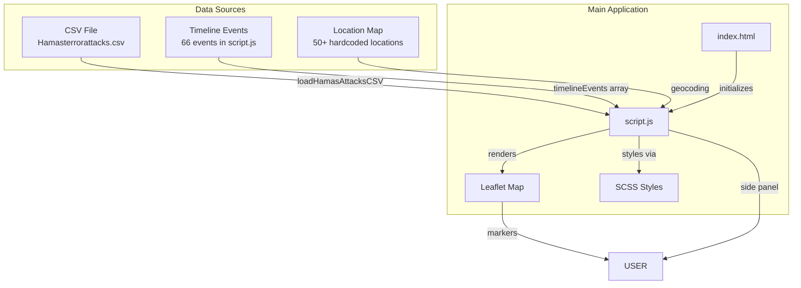
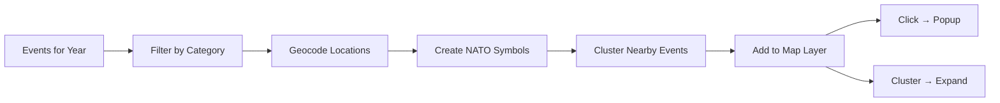
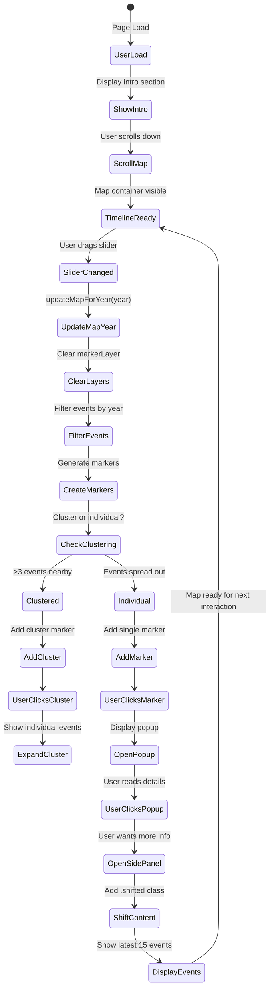
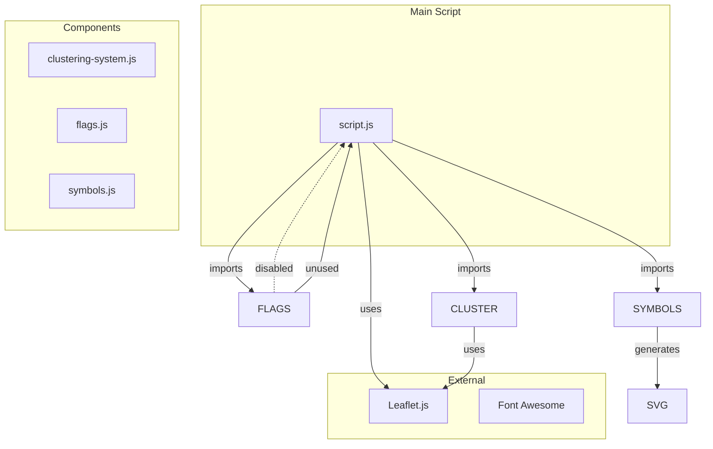
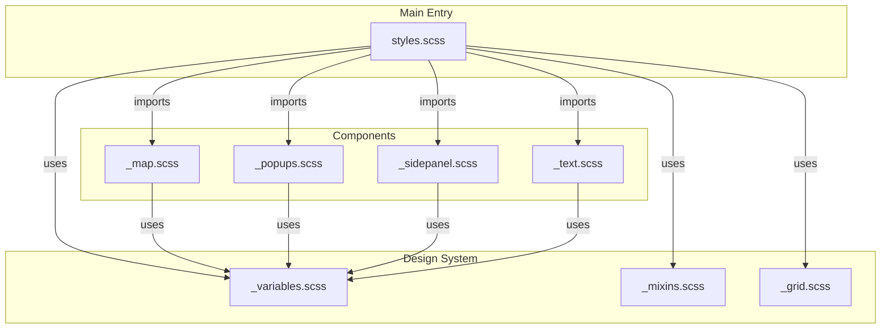
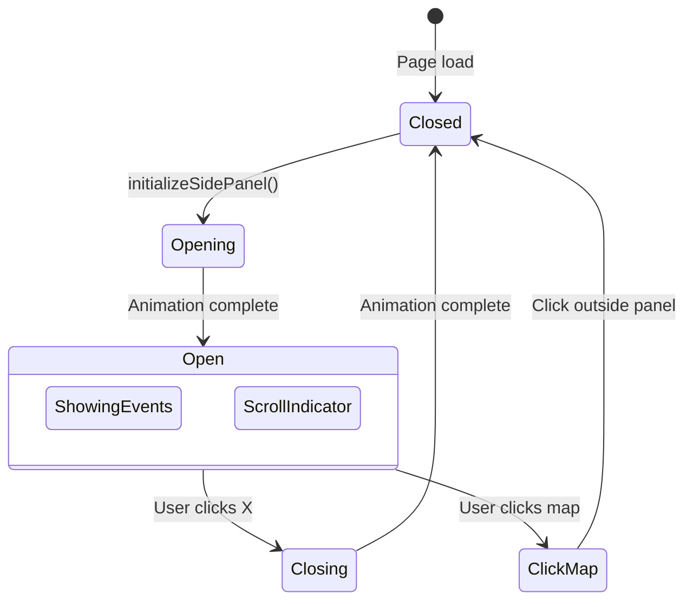
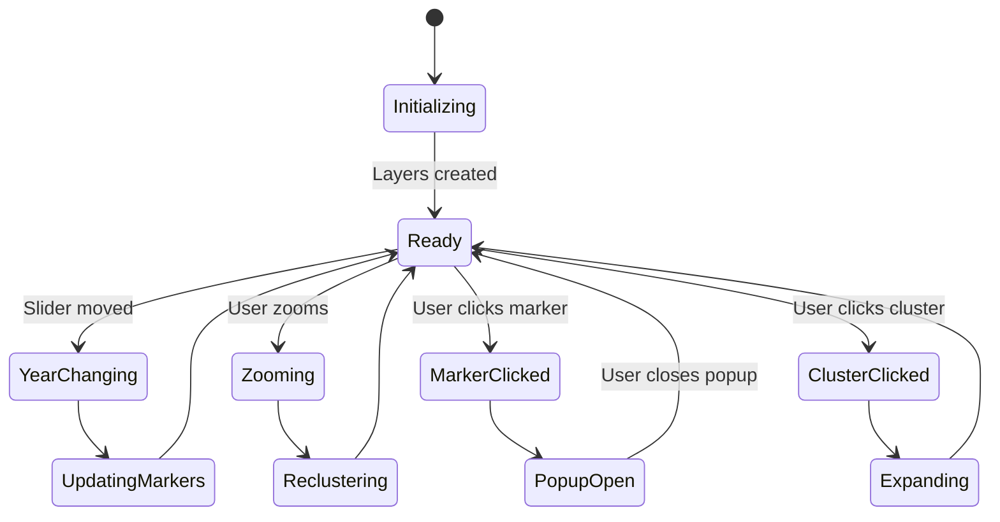

# 2026-Conflict Project

## Project Overview
An interactive web application visualizing the Israel-Hamas conflict with historical timeline and military map. Features a clean Swiss design aesthetic with white backgrounds, black text, and NATO military symbology.

## Key Features
- **Interactive Timeline**: Slider with year navigation, displays latest 15 events on page load
- **Swiss Design Theme**: White backgrounds, black text, minimal styling
- **White Map**: Clean light tile base with military-style overlays
- **NATO Symbology**: 1994-era military symbols with color-coded affiliations
- **Side Panel**: 360px drawer that opens on page load showing latest events with date
- **Smooth Transitions**: All UI elements shift when side panel opens/closes

# Project Architecture & Component Lifecycle

> **Auto-generated documentation** - Run `npm run docs:update` to refresh diagrams based on current file structure.

## Table of Contents

1. [File Structure](#file-structure)
2. [Data Flow](#data-flow)
3. [Component Lifecycle](#component-lifecycle)
4. [Event Lifecycle](#event-lifecycle)
5. [Dependency Graph](#dependency-graph)
6. [State Machine](#state-machine)
7. [Key Functions Reference](#key-functions-reference)

---

## File Structure

```
2026-Conflict/
├── 📄 index.html
├── 📄 package.json
├── 📄 README.md
├── 📄 ARCHITECTURE.md
│
├── 📂 js/
│   ├── 📄 script.js
│   └── 📂 components/
│       ├── 📄 clustering-system.js
│       ├── 📄 flags.js
│       └── 📄 symbols.js
│
├── 📂 scss/
│   ├── 📄 styles.scss
│   ├── 📄 _grid.scss
│   ├── 📄 _mixins.scss
│   ├── 📄 _variables.scss
│   ├── 📄 _map.scss
│   ├── 📄 _mixins.scss
│   ├── 📄 _popups.scss
│   ├── 📄 _sidepanel.scss
│   ├── 📄 _text.scss
│   ├── 📄 _variables.scss
│   ├── 📄 _map.scss
│   ├── 📄 _popups.scss
│   ├── 📄 _sidepanel.scss
│   ├── 📄 _text.scss
│   └── 📂 components/
│       ├── 📄 _map.scss
│       ├── 📄 _popups.scss
│       ├── 📄 _sidepanel.scss
│       └── 📄 _text.scss
│
├── 📂 data/
│   └── 📄 Hamasterrorattacks.csv
│
└── 📂 assets/
```

---

## Data Flow



---

## Component Lifecycle


### Event Rendering Pipeline



---

## Event Lifecycle



---

## Dependency Graph

### JavaScript Dependencies



### SCSS Dependencies



---

## State Machine

### Side Panel States



### Map States



---

## Key Functions Reference

| Function | File | Line | Purpose |
|----------|------|------|---------|

### Initialization

| Function | File | Line | Purpose |
|----------|------|------|---------|
| `createEnhancedPopup()` | js/components/clustering-system.js | ~195 | Create Enhanced Popup |
| `createEnhancedMilitaryMarker()` | js/components/clustering-system.js | ~382 | Create Enhanced Military Marker |
| `createClusterMarker()` | js/components/clustering-system.js | ~487 | Create Cluster Marker |
| `createEventCardPopup()` | js/components/clustering-system.js | ~527 | Create Event Card Popup |
| `setupEnhancedLegend()` | js/components/clustering-system.js | ~580 | Setup Enhanced Legend |
| `setupLegendControls()` | js/components/clustering-system.js | ~769 | Setup Legend Controls |
| `createEnhancedMilitaryMarkerOptimized()` | js/components/clustering-system.js | ~927 | Create Enhanced Military Marker Optimized |
| `createClusterMarkerOptimized()` | js/components/clustering-system.js | ~965 | Create Cluster Marker Optimized |
| `initializeClusteringSystem()` | js/components/clustering-system.js | ~1167 | Initialize Clustering System |
| `setupLeftLegend()` | js/components/clustering-system.js | ~1195 | Setup Left Legend |
| `loadHamasAttacksCSV()` | js/script.js | ~38 | Load Hamas Attacks C S V |
| `initializeTimeline()` | js/script.js | ~1643 | Initialize Timeline |
| `createTimelineEvent()` | js/script.js | ~1668 | Create Timeline Event |
| `setupEventListeners()` | js/script.js | ~1729 | Setup Event Listeners |
| `initializeMap()` | js/script.js | ~1796 | Initialize Map |
| `setupMapControls()` | js/script.js | ~2262 | Setup Map Controls |
| `createTickMarks()` | js/script.js | ~2515 | Create Tick Marks |
| `initializeTimelineTicks()` | js/script.js | ~2598 | Initialize Timeline Ticks |
| `createMarkerIcon()` | js/script.js | ~2934 | Create Marker Icon |
| `createClusterCountMarker()` | js/script.js | ~3111 | Create Cluster Count Marker |
| `initializeSidePanel()` | js/script.js | ~3430 | Initialize Side Panel |
| `setupMapClickHandler()` | js/script.js | ~3472 | Setup Map Click Handler |
| `createDirectionalArrow()` | js/script.js | ~3943 | Create Directional Arrow |
| `createFactionMarker()` | js/script.js | ~4001 | Create Faction Marker |
| `createMovementNATOSymbol()` | js/script.js | ~4055 | Create Movement N A T O Symbol |
| `createMovementArrow()` | js/script.js | ~4075 | Create Movement Arrow |
| `initializeCheckboxStates()` | js/script.js | ~4189 | Initialize Checkbox States |
| `initializeScrollToMapButton()` | js/script.js | ~4440 | Initialize Scroll To Map Button |

### Rendering

| Function | File | Line | Purpose |
|----------|------|------|---------|
| `drawAllEventMarkersWithClustering()` | js/components/clustering-system.js | ~247 | Draw All Event Markers With Clustering |
| `drawAllEventMarkers()` | js/components/clustering-system.js | ~809 | Draw All Event Markers |
| `drawAllEventMarkersOptimized()` | js/components/clustering-system.js | ~1009 | Draw All Event Markers Optimized |
| `addMilitaryGrid()` | js/script.js | ~1872 | Add Military Grid |
| `addMapLegend()` | js/script.js | ~1946 | Add Map Legend |
| `updateActiveTickMarks()` | js/script.js | ~2578 | Update Active Tick Marks |
| `updateMapForYear()` | js/script.js | ~2669 | Update Map For Year |
| `drawTerritoryControl()` | js/script.js | ~2800 | Draw Territory Control |
| `updateSidePanelState()` | js/script.js | ~3257 | Update Side Panel State |
| `drawAllEventMarkers()` | js/script.js | ~3501 | Draw All Event Markers |
| `drawMovementPaths()` | js/script.js | ~3790 | Draw Movement Paths |
| `addMajorCities()` | js/script.js | ~4093 | Add Major Cities |
| `updateStatistics()` | js/script.js | ~4130 | Update Statistics |
| `updateLegendCounts()` | js/script.js | ~4164 | Update Legend Counts |
| `updateLegendForFilters()` | js/script.js | ~4201 | Update Legend For Filters |

### Data

| Function | File | Line | Purpose |
|----------|------|------|---------|
| `getEventYear()` | js/components/clustering-system.js | ~189 | Get Event Year |
| `groupEventsByCoordinates()` | js/components/clustering-system.js | ~227 | Group Events By Coordinates |
| `getSpiralOffset()` | js/components/clustering-system.js | ~238 | Get Spiral Offset |
| `determineMilitaryDetails()` | js/components/clustering-system.js | ~420 | Determine Military Details |
| `generateCompleteNATOLegend()` | js/components/clustering-system.js | ~609 | Generate Complete N A T O Legend |
| `generateFlagSubsection()` | js/components/clustering-system.js | ~745 | Generate Flag Subsection |
| `generateLegacyDropdownOptions()` | js/components/clustering-system.js | ~1208 | Generate Legacy Dropdown Options |
| `getNearbyEvents()` | js/components/clustering-system.js | ~1219 | Get Nearby Events |
| `parseCSV()` | js/script.js | ~6 | Parse C S V |
| `convertCSVToEvent()` | js/script.js | ~62 | Convert C S V To Event |
| `extractYear()` | js/script.js | ~64 | Extract Year |
| `getCoordinates()` | js/script.js | ~76 | Get Coordinates |
| `getIntensity()` | js/script.js | ~187 | Get Intensity |
| `getAllEvents()` | js/script.js | ~238 | Get All Events |
| `getAllEventsSync()` | js/script.js | ~254 | Get All Events Sync |
| `detectInvolvedNations()` | js/script.js | ~263 | Detect Involved Nations |
| `enhanceEventWithMilitaryData()` | js/script.js | ~338 | Enhance Event With Military Data |
| `filterTimeline()` | js/script.js | ~1753 | Filter Timeline |
| `filterByEra()` | js/script.js | ~1765 | Filter By Era |
| `observeTimelineEvents()` | js/script.js | ~1777 | Observe Timeline Events |
| `generateTerritoryLegend()` | js/script.js | ~2034 | Generate Territory Legend |
| `generateMilitaryFactionsLegend()` | js/script.js | ~2061 | Generate Military Factions Legend |
| `getFrameSVG()` | js/script.js | ~2106 | Get Frame S V G |
| `generateMilitarySymbolsLegend()` | js/script.js | ~2120 | Generate Military Symbols Legend |
| `generateNationalForcesLegend()` | js/script.js | ~2160 | Generate National Forces Legend |
| `generateEventTypesLegend()` | js/script.js | ~2180 | Generate Event Types Legend |
| `generateNationalForcesLegend()` | js/script.js | ~2211 | Generate National Forces Legend |
| `generateEventTypesLegend()` | js/script.js | ~2231 | Generate Event Types Legend |
| `startMapAnimation()` | js/script.js | ~2333 | Start Map Animation |
| `pauseMapAnimation()` | js/script.js | ~2363 | Pause Map Animation |
| `handleSliderChange()` | js/script.js | ~2378 | Handle Slider Change |
| `getEventYears()` | js/script.js | ~2423 | Get Event Years |
| `getYearsWithCoordinates()` | js/script.js | ~2468 | Get Years With Coordinates |
| `findNearestEventYear()` | js/script.js | ~2497 | Find Nearest Event Year |
| `handleSpeedChange()` | js/script.js | ~2623 | Handle Speed Change |
| `getEventYear()` | js/script.js | ~2632 | Get Event Year |
| `getFilteredEventsForYear()` | js/script.js | ~2661 | Get Filtered Events For Year |
| `groupEventsByCoordinates()` | js/script.js | ~3010 | Group Events By Coordinates |
| `getHierarchicalOffset()` | js/script.js | ~3046 | Get Hierarchical Offset |
| `sortEventsByPriority()` | js/script.js | ~3070 | Sort Events By Priority |
| `calculateEventPriority()` | js/script.js | ~3079 | Calculate Event Priority |
| `toggleSidePanel()` | js/script.js | ~3299 | Toggle Side Panel |
| `openEventSidePanel()` | js/script.js | ~3320 | Open Event Side Panel |
| `showAllVisibleEvents()` | js/script.js | ~3483 | Show All Visible Events |
| `getFactionColor()` | js/script.js | ~3706 | Get Faction Color |
| `getSpiralOffsetForCoord()` | js/script.js | ~3766 | Get Spiral Offset For Coord |
| `calculateBearing()` | js/script.js | ~3975 | Calculate Bearing |
| `getFactionDashPattern()` | js/script.js | ~3989 | Get Faction Dash Pattern |
| `syncLegendDropdown()` | js/script.js | ~4217 | Sync Legend Dropdown |
| `refreshCurrentYear()` | js/script.js | ~4228 | Refresh Current Year |


---

## Inline Styles Status

> **Note:** Documentation mentions ~0 inline style assignments remaining in JS files.

Areas with inline styles that could be migrated to SCSS:
- Dynamic marker styling
- Popup content styling
- Animation configurations

---

## Auto-Update Instructions

To regenerate this document based on current file structure:

```bash
npm run docs:update
```

This script:
1. Scans `js/` and `scss/` directories
2. Extracts import/dependency relationships
3. Updates the File Structure section
4. Updates the Dependency Graph section
5. Rebuilds Mermaid diagrams

---

*Last updated: 2026-02-09*
*Generated by: scripts/generate-architecture.js*


## Quick Start

```bash
npm run dev      # Development server at http://localhost:3000
npm run build    # Production build
npm run preview  # Preview production build
```

## Architecture

### File Structure
```
├── index.html                    # Main HTML entry point
├── package.json                  # Project configuration
├── README.md                     # This file
├── scss/                         # SCSS stylesheets
│   ├── styles.scss              # Main styles entry
│   ├── _variables.scss          # Design tokens
│   └── components/
│       ├── _map.scss           # Map & legend styles
│       ├── _popups.scss        # Popup styles
│       └── _sidepanel.scss     # Side panel styles
├── js/
│   ├── script.js               # Main application logic
│   └── components/
│       ├── clustering-system.js # Event clustering
│       ├── flags.js            # Flag system (disabled by default)
│       └── symbols.js          # NATO symbol generation
└── data/
    └── Hamasterrorattacks.csv  # Attack database
```

### Side Panel Behavior
- **Default**: Opens on page load with latest 15 events
- **Width**: 360px, slides in from left
- **Content Shift**: Header, intro, map-container, and footer shift right by 360px when open
- **Close**: Click X button or click on map to close
- **Header**: Shows "Latest Events (YYYY-MM-DD)" with the most recent event date

### Design System

#### Colors (Swiss Theme)
```scss
$bg-primary: #FFFFFF;
$bg-secondary: #F5F5F5;
$bg-tertiary: #E8E8E8;
$text-primary: #000000;
$text-secondary: #333333;
$text-muted: #666666;
$map-border: #E0E0E0;
```

#### NATO Affiliation Colors
```scss
$nato-friendly: #0066CC;   // Israeli-aligned
$nato-hostile: #CC0000;    // Hamas/hostile
$nato-neutral: #00AA00;   // Neutral forces
$nato-unknown: #FFAA00;    // Unknown
```

### Map Configuration
- **Tiles**: CARTO Light All (white/clean map)
- **Center**: [31.5, 35.0] (Israel/Palestine region)
- **Default Zoom**: 7
- **Grid**: Subtle black dashed lines on white

### Event Side Panel
Displays latest 15 events sorted by date (newest first):
- Event title, date, category (military/political/social)
- Description, impact, territory control percentages
- Casualty counts, involved nations

## JavaScript Key Functions

### Side Panel
```javascript
initializeSidePanel()     // Load latest 15 events on page load
openEventSidePanel()      // Populate panel with events
toggleSidePanel()         // Open/close drawer
updateSidePanelState()    // Handle .shifted classes for content
```

### Map Rendering
```javascript
updateMapForYear(year)    // Update markers for year
drawMovementPaths()       // Draw military movements
addMapLegend()           // Add legend control
```

### Timeline
```javascript
handleSliderChange()     // Year navigation
startMapAnimation()      // Auto-play through years
```

## Performance Fixes Applied

### Ghosting Prevention
- Zoom handler clears all layers before redrawing
- Debounced zoom events (150ms)
- Clustering cache cleared on zoom
- All layer groups cleared: markerLayer, flagLayer, movementLayer, territoryLayer

### Flag System
- Disabled by default (`showFlags: false`)
- Flags embedded in markers removed to prevent duplicates
- Legacy flag overlay code preserved but not used

## CSS Architecture

### Component Files
- `_map.scss`: Map container, tiles, legend, popups, movement paths
- `_popups.scss`: All popup styling with white theme
- `_sidepanel.scss`: Side drawer, events list, transitions

### Leaflet Overrides
Comprehensive overrides force white theme on all map elements:
- Container background
- Tile layers
- All popup components
- Zoom controls
- Attribution
- Layer controls

## Responsive Design
- Side panel: 360px width on desktop, full-width overlay on mobile (<768px)
- Map: 600px height, 450px on tablet, 350px on mobile
- All transitions disabled on mobile for panel

## Dependencies
- Leaflet.js (CDN)
- Font Awesome (CDN)
- Vite + Sass (dev/build)
